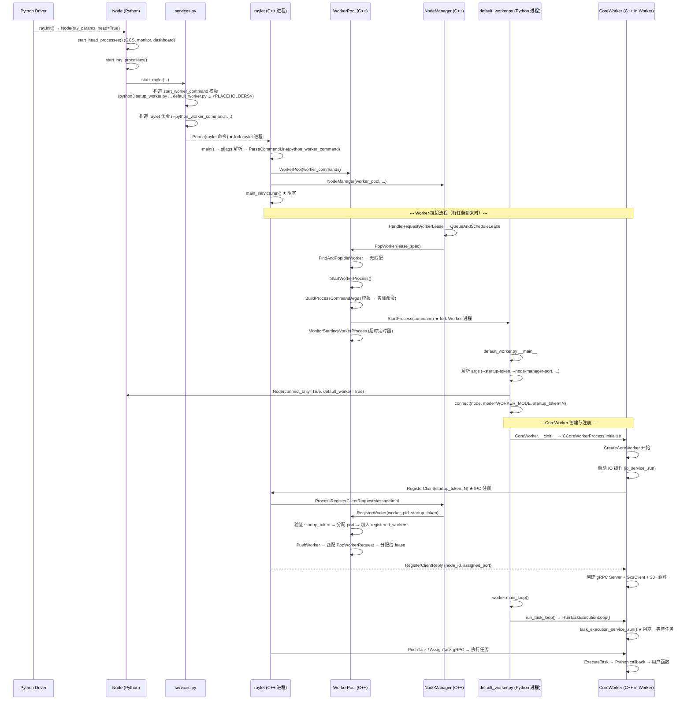
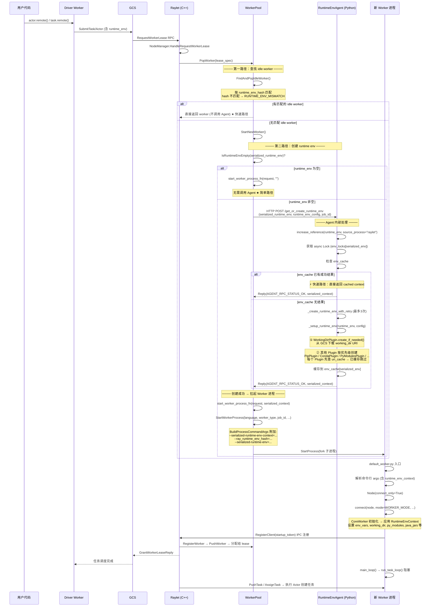
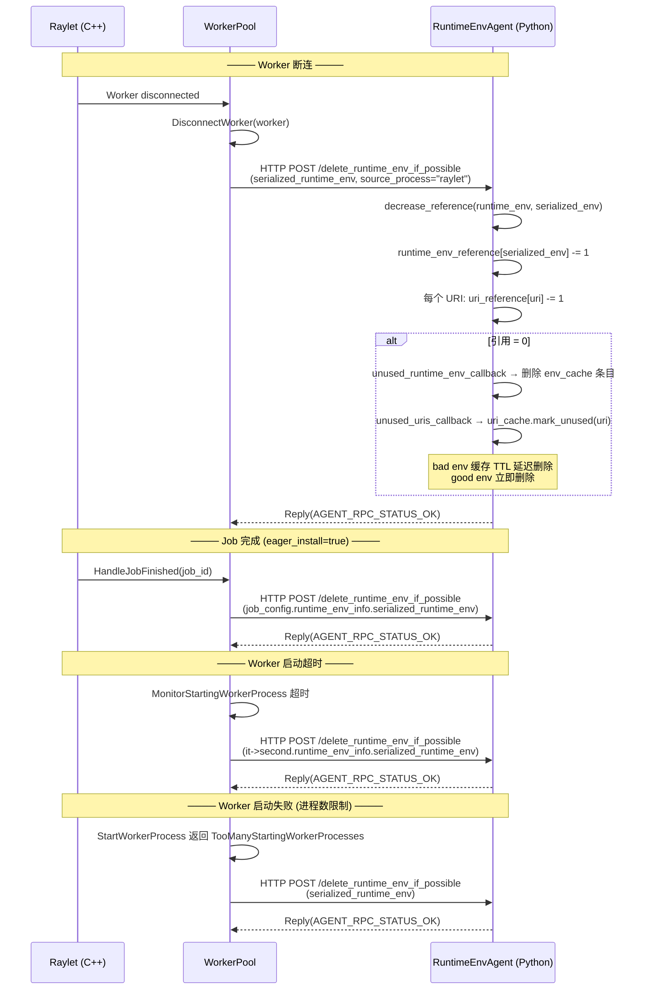

# Ray: Raylet 启动与 Worker/Actor 进程拉起完整流程

> 从 `ray.init()` 触发 raylet 启动，到 raylet 拉起一个新的 worker/actor 进程并完成注册的全链路解析。

---

## 1) 整体架构概览

Ray 的进程模型：

```
ray.init() (Python driver 进程)
  ├── Node (Python)           — 基础设施管理：启动 raylet、plasma store 等守护进程
  │     ├── raylet (C++ 进程)  — 本节点调度器 + worker 池管理 + 对象管理
  │     ├── plasma_store       — 共享内存对象存储
  │     ├── gcs_server         — 全局状态服务（仅 head node 启动）
  │     └── dashboard_agent    — 监控代理
  └── CoreWorker (C++ in-process) — 任务运行时：接收/执行任务、对象引用管理、gRPC 通信
      ├── io_service_ 线程      — IO 事件循环
      ├── task_execution_service_ 线程 — 任务执行循环（worker 主线程阻塞于此）
      └── TaskEventBuffer 线程  — 任务事件 flush
```

Worker/Actor 进程（由 raylet fork 出来）：

```
default_worker.py (Python 进程)
  ├── Node (Python, connect_only=True) — 只读取连接信息，不启动守护进程
  └── CoreWorker (C++ in-process)
      ├── 注册到 raylet（IPC）
      ├── 启动 gRPC server
      ├── 连接 GCS
      └── run_task_loop() → task_execution_service_.run() 阻塞
```

---

## 2) 第一阶段：raylet 进程的启动

### 2.1 调用链

```
ray.init()
  → worker.py: init() (line 1416)
    → node.py: Node(ray_params, head=True)
      → node.py: __init__ (line 64)
        → node.py: start_head_processes() (line 340)   # head node 特有
          → start_gcs_server / start_monitor / start_api_server
        → node.py: start_ray_processes() (line 343)
          → node.py: start_raylet() (line 1445)         # ★ 关键步骤
            → services.py: start_raylet() (line 1518)   # ★ 构造命令并启动进程
```

### 2.2 Node 的角色

`Node` (`python/ray/_private/node.py`) 是一个 Ray 节点的**基础设施管理器**，职责是启动和管理本节点的守护进程。

对于 **head node**（`ray.init()` 在 driver 进程中创建）：
- `head=True` → 先调用 `start_head_processes()`（启动 GCS server、monitor、dashboard 等）
- 然后调用 `start_ray_processes()`（启动 plasma store、raylet）

对于 **worker node**（`ray start` 命令创建）：
- `head=False` → 直接调用 `start_ray_processes()`（不启动 GCS 等 head-only 进程）

对于 **default_worker.py 进程**（raylet fork 出来的）：
- `connect_only=True, default_worker=True` → **不启动任何进程**，只从 GCS 读取 socket 信息
- `assert not self._default_worker` 出现在 head-only 的逻辑分支中

### 2.3 Node vs CoreWorker 的关系

| | Node (Python) | CoreWorker (C++) |
|---|---|---|
| **角色** | 节点基础设施管理器 | 进程内任务运行时 |
| **职责** | 启动/管理 raylet、plasma store、GCS 等守护进程；提供连接信息 | 接收/执行任务、管理对象引用、gRPC 通信 |
| **生命周期** | 随 `ray.init()` 或 `ray start` 创建 | 随 `connect()` 中 CoreWorker 构造创建 |
| **数量** | 每个节点一个 | 每个进程一个（driver 和 worker 都有） |

Node 是 CoreWorker 的**"接线员"**——提供本节点的基础设施连接信息：

```python
# worker.py: connect() 中 (line 2657)
worker.core_worker = ray._raylet.CoreWorker(
    mode,
    node.plasma_store_socket_name,   # Node 提供的 plasma socket
    node.raylet_socket_name,         # Node 提供的 raylet IPC socket
    job_id,
    gcs_options,
    ...
    node.node_ip_address,            # Node 提供的本节点 IP
    node.node_manager_port,          # Node 提供的 raylet 端口
    ...
)
```

CoreWorker 使用这些信息连接到 raylet（IPC）、Plasma Store（读写对象）和建立自己的 gRPC server。

---

## 3) 第二阶段：services.py 启动 raylet 进程

### 3.1 命令构造

`services.py: start_raylet()` (line 1518-1946) 构造 raylet 进程的完整命令行。

核心命令（line 1845-1876）：

```python
command = [
    RAYLET_EXECUTABLE,                    # C++ raylet 二进制
    f"--raylet_socket_name={raylet_name}",
    f"--store_socket_name={plasma_store_name}",
    f"--node_manager_port={node_manager_port}",
    f"--node_id={node_id}",
    f"--node_ip_address={node_ip_address}",
    f"--maximum_startup_concurrency={maximum_startup_concurrency}",
    f"--static_resource_list={resource_argument}",
    f"--python_worker_command={subprocess.list2cmdline(start_worker_command)}",  # ★
    f"--java_worker_command=...",
    f"--cpp_worker_command=...",
    f"--gcs-address={gcs_address}",
    f"--session-name={session_name}",
    f"--cluster-id={cluster_id}",
    ...
]
```

### 3.2 RAYLET_EXECUTABLE

```python
# services.py: line 58-60
RAYLET_EXECUTABLE = os.path.join(
    RAY_PATH, "core", "src", "ray", "raylet", "raylet" + EXE_SUFFIX
)
```

这是 Ray 编译产出的 C++ 二进制文件，路径类似 `.../ray/core/src/ray/raylet/raylet`。

### 3.3 python_worker_command 的构造

**这是 Python → C++ 串联的关键**。raylet 是 C++ 进程，它需要知道如何启动 Python worker，所以 Python 在启动 raylet 时把 worker 启动命令模板作为参数传入。

`start_worker_command` 的构造（services.py: line 1713-1736）：

```python
start_worker_command = [
    sys.executable,                        # e.g. "/usr/bin/python3"
    setup_worker_path,                     # setup_worker.py（runtime env 安装脚本）
    ... _site_flags(),                     # 继承当前解释器的 -S/-s 标志
    worker_path,                           # default_worker.py 的绝对路径 ★
    f"--node-ip-address={node_ip_address}",
    "--node-manager-port=RAY_NODE_MANAGER_PORT_PLACEHOLDER",  # ★ 占位符
    f"--object-store-name={plasma_store_name}",
    f"--raylet-name={raylet_name}",
    f"--redis-address={redis_address}",
    f"--gcs-address={gcs_address}",
    "RAY_WORKER_DYNAMIC_OPTION_PLACEHOLDER",  # ★ 占位符
    ...
]
```

其中 `worker_path` 在 `Node.__init__` (node.py: line 135-139) 中设定：

```python
ray_params.update_if_absent(
    worker_path=os.path.join(
        os.path.dirname(os.path.abspath(__file__)),
        "workers",
        "default_worker.py",       # ★ Python worker 入口文件
    ),
)
```

**两个占位符**：
- `RAY_NODE_MANAGER_PORT_PLACEHOLDER` — raylet 启动 worker 时替换为自己的实际端口（因为 raylet 启动时才知道自己的端口）
- `RAY_WORKER_DYNAMIC_OPTION_PLACEHOLDER` — raylet 根据任务需求插入 dynamic worker options（如 `@ray.remote(num_cpus=2)` 的资源配置）

最终通过 `subprocess.list2cmdline()` 序列化为一个字符串，作为 `--python_worker_command=` flag 传入 raylet 进程。

### 3.4 进程启动

```python
# services.py: line 1934-1946
process_info = start_ray_process(
    command,                                # 完整的 raylet 命令行
    ray_constants.PROCESS_TYPE_RAYLET,
    ...
)
```

`start_ray_process()` (services.py: line 797) 使用 `ConsolePopen`（即 `subprocess.Popen` 的封装）fork 出 raylet 子进程。

---

## 4) 第三阶段：raylet C++ 进程初始化

### 4.1 main() 入口

`src/ray/raylet/main.cc` (line 181)：

```cpp
int main(int argc, char *argv[]) {
    gflags::ParseCommandLineFlags(&argc, &argv, true);
    // ... 解析所有 flag ...
}
```

### 4.2 worker_command 的解析与存储

raylet 通过 gflags 接收 Python 传入的 worker 启动命令（line 246, 572-574）：

```cpp
const std::string python_worker_command = FLAGS_python_worker_command;

// ...
node_manager_config.worker_commands.emplace(
    make_pair(ray::Language::PYTHON, ParseCommandLine(python_worker_command)));
```

`ParseCommandLine()` 将序列化的字符串还原为 `vector<string>`。这个 map 最终传给 `WorkerPool` 构造函数，存储在每个语言的 `State.worker_command` 中。

### 4.3 WorkerPool 创建

main.cc (line 655-690)：

```cpp
worker_pool = std::make_unique<ray::raylet::WorkerPool>(
    main_service,
    raylet_node_id,
    ...
    node_manager_config.worker_commands,     // ★ worker 启动命令模板
    ...
);
```

`WorkerPool` 构造函数 (worker_pool.cc: line 85-100) 将 `worker_commands` 存入 `states_` map，每种语言有自己的 `State`，其中 `State.worker_command` 就是启动 worker 时使用的命令模板。

### 4.4 NodeManager 创建与事件循环启动

main.cc 继续创建 `NodeManager`、`ObjectManager` 等，然后 raylet 进入主事件循环：

```cpp
main_service.run();  // raylet 的 boost::asio IO 事件循环阻塞于此
```

---

## 5) 第四阶段：raylet 拉起新 Worker 进程

当有任务需要执行时，完整的 worker 拉起流程如下：

### 5.1 任务调度 → Worker Lease 请求

1. GCS 或本地调度器向 raylet 发送 `RequestWorkerLease` gRPC
2. `NodeManager::HandleRequestWorkerLease` (node_manager.cc: line 1778) 接收请求
3. 解析 `LeaseSpecification`，判断是否为 actor creation task
4. 调用 `cluster_lease_manager_.QueueAndScheduleLease()` 排队调度

### 5.2 调度 → PopWorker

5. 调度器调用 `WorkerPool::PopWorker(lease_spec, callback)` (worker_pool.cc: line 1394)
6. 创建 `PopWorkerRequest`，包含 language、worker_type、job_id、`is_actor_worker`（来自 `lease_spec.IsActorCreationTask()`）、runtime_env_hash 等
7. 先尝试从 **idle pool** 中找到匹配的已注册 worker (`FindAndPopIdleWorker`)，匹配条件包括 runtime_env_hash、job_id、dynamic_options 等
8. 如果 idle pool 中没有匹配的 worker，则调用 **StartWorkerProcess** 创建新进程

### 5.3 StartWorkerProcess：构造命令并启动进程

`WorkerPool::StartWorkerProcess` (worker_pool.cc: line 463-547)：

```cpp
std::tuple<Process, StartupToken> WorkerPool::StartWorkerProcess(
    const Language &language,
    const rpc::WorkerType worker_type,
    const JobID &job_id,
    PopWorkerStatus *status,
    ...) {
    // 1. 检查并发限制（maximum_startup_concurrency）
    // 2. 调用 BuildProcessCommandArgs 构造命令行
    auto [worker_command_args, env] = BuildProcessCommandArgs(...);
    // 3. StartProcess fork 子进程
    Process proc = StartProcess(worker_command_args, env);
    // 4. 生成 startup_token，监控注册超时
    MonitorStartingWorkerProcess(worker_startup_token_counter_, ...);
    // 5. 返回 (Process, StartupToken)
}
```

### 5.4 BuildProcessCommandArgs：从模板到实际命令

`BuildProcessCommandArgs` (worker_pool.cc: line 265-343) 从 `state.worker_command` 读出模板，逐 token 处理：

- 遇到 `kWorkerDynamicOptionPlaceholder` → 替换为 dynamic options + runtime env hash 等
- 遇到 `kNodeManagerPortPlaceholder` → 替换为 raylet 实际端口
- 附加 `--startup-token=<token>`、`--worker-launch-time-ms=<ms>`、`--runtime-env-hash=<hash>`、`--node-id=<hex>` 等

所以最终 raylet 启动 Python worker 的命令大致为：

```
/path/to/python3 /path/to/setup_worker.py -S ... \
    /path/to/default_worker.py \
    --node-ip-address=X.X.X.X \
    --node-manager-port=12345 \          # ★ 从占位符替换为实际端口
    --object-store-name=/tmp/plasma_store \
    --raylet-name=/tmp/raylet \
    --redis-address=... \
    --gcs-address=... \
    [dynamic_options...] \               # ★ 从占位符替换
    --startup-token=42 \                 # ★ raylet 生成
    --worker-launch-time-ms=... \
    --runtime-env-hash=123 \
    --node-id=abcdef \
    --cluster-id=... \
    --session-name=...
```

### 5.5 StartProcess：fork 子进程

`StartProcess` (worker_pool.cc: line 636-693) 使用 `Process` 类 fork 子进程：

```cpp
Process child(argv.data(),
              io_service_,
              ec,
              /*decouple=*/false,
              env,
              /*pipe_to_stdin=*/false,
              add_to_cgroup_hook_,
              new_process_group);
```

- 设置独立 process group（便于 killpg 清理）
- 可选 cgroup 资源隔离
- 注册超时定时器：如果 worker 在 `worker_register_timeout_seconds` 内没完成注册，raylet kill 进程

### 5.6 setup_worker.py → default_worker.py 的衔接

raylet 先启动 `setup_worker.py`（runtime env 安装脚本），完成环境安装后，`setup_worker.py` 通过 `execv` 替换进程映像为 `default_worker.py`，这样 worker 进程 PID 不变，但执行的代码从 setup 脚本变为正式的 worker 入口。

---

## 6) 第五阶段：Python Worker 进程初始化

新进程启动后执行 `default_worker.py` (python/ray/_private/workers/default_worker.py)：

### 6.1 入口流程

```python
if __name__ == "__main__":
    args = parser.parse_args()                    # 解析 raylet 传入的命令行参数
    # --startup-token, --node-manager-port, --runtime-env-hash, ...

    mode = ray.WORKER_MODE                        # Worker 类型

    try_install_uvloop()                           # 可选：安装 uvloop

    ray_params = RayParams(...)                    # 构造参数
    node = ray._private.node.Node(                 # ★ 创建 Node（connect_only=True）
        ray_params,
        head=False,
        shutdown_at_exit=False,
        spawn_reaper=False,
        connect_only=True,                         # ★ 只连接，不启动守护进程
        default_worker=True,                        # ★ 标记为 default worker
    )

    ray._private.worker.connect(                   # ★ 创建 CoreWorker 并注册到 raylet
        node,
        node.session_name,
        mode=mode,
        runtime_env_hash=args.runtime_env_hash,
        startup_token=args.startup_token,
        ...
    )

    worker = ray._private.worker.global_worker

    # 设置日志、preload modules、setup hook 等

    worker.main_loop()                             # ★ 进入任务执行循环
```

### 6.2 Node 在 Worker 进程中的角色

Worker 进程中的 Node 是"轻量的"——`connect_only=True, default_worker=True`：
- **不启动** raylet、plasma store 等守护进程
- **只从 GCS 读取** 已有节点的 socket 信息（plasma_store_socket_name、raylet_socket_name、node_manager_port）
- 提供 CoreWorker 需要的连接参数

---

## 7) 第六阶段：CoreWorker 创建与 Raylet 注册

### 7.1 connect() → CoreWorker 创建

`worker.py: connect()` (line 2444) 中创建 CoreWorker Cython 实例 (line 2657)：

```python
worker.core_worker = ray._raylet.CoreWorker(
    mode,                                   # WORKER_MODE
    node.plasma_store_socket_name,          # Node 提供的 plasma socket
    node.raylet_socket_name,                # Node 提供的 raylet IPC socket
    job_id,                                 # JobID.nil()（worker 模式）
    gcs_options,
    logs_dir,
    node.node_ip_address,
    node.node_manager_port,
    (mode == LOCAL_MODE),                   # False
    driver_name,
    serialized_job_config,
    node.metrics_agent_port,
    runtime_env_hash,
    startup_token,                          # ★ raylet 分配的唯一标识
    session_name,
    node.cluster_id.hex(),
    ...
)
```

### 7.2 C++ CoreWorkerProcessImpl::CreateCoreWorker 初始化序列

`core_worker_process.cc` (line 135-694) 严格按序执行：

1. **启动 IO 线程**（line 184）— `io_service_.run()` 在 `io_thread_` 上运行
2. **通过 IPC 向 Raylet 注册**（line 207-221）— `raylet_ipc_client->RegisterClient()`
   - 发送 `RegisterClientRequest`，携带 `startup_token`
   - 注册成功后获得 `local_node_id` 和 `assigned_port`（raylet 分配的 gRPC 端口）
3. **创建 gRPC Server**（line 243-253）
4. **创建 GcsClient 并连接**（line 266-268）
5. **创建 TaskEventBuffer 并启动**（line 270-274）
6. ...（30+ 其他组件初始化）
7. **CoreWorker 构造**（line 661-692）

**关键顺序约束**：
- IO 线程必须先启动（后续注册和 RPC 都依赖 `io_service_`）
- Raylet 注册必须在 gRPC Server 启动后（raylet 注册后会立即开始向 CoreWorker 发送 RPC）

### 7.3 Raylet 处理注册请求

Raylet 收到 IPC `RegisterClientRequest` 后：

`NodeManager::ProcessRegisterClientRequestMessageImpl` (node_manager.cc: line 1177-1251)：

1. 解析 startup_token、worker_id、pid、worker_type 等
2. 创建 `Worker` 对象 (line 1198-1207)
3. 调用 `WorkerPool::RegisterWorker` (worker_pool.cc: line 788-843)：
   - 验证 startup_token 是否匹配已启动的进程
   - 分配 gRPC 端口（`GetNextFreePort`）
   - 将 worker 加入 `registered_workers`
   - 发送 `RegisterClientReply`（包含 node_id 和 assigned_port）

4. 注册完成后 `WorkerPool::PushWorker` (worker_pool.cc: line 1088-1155) 尝试匹配 pending 的 `PopWorkerRequest`：
   - 如果匹配到 lease 请求 → worker 被分配给该 lease（becomes leased worker）
   - 如果没有匹配 → worker 进入 idle pool

---

## 8) 第七阶段：Worker 进入任务执行循环

### 8.1 main_loop → run_task_loop

```python
# worker.py: line 1021-1032
def main_loop(self):
    ray._private.utils.set_sigterm_handler(sigterm_handler)
    self.core_worker.run_task_loop()     # ★ Python 主线程阻塞于此
    sys.exit(0)
```

### 8.2 C++ RunTaskExecutionLoop

`core_worker.cc` (line 2693-2723)：

```cpp
void CoreWorker::RunTaskExecutionLoop() {
    // 在 task_execution_service_ 上运行
    task_execution_service_.run();       // ★ 阻塞在此
}
```

Python 主线程从此**不再执行用户代码**，而是阻塞在 `task_execution_service_.run()` 上，等待 raylet 通过 gRPC 分发任务。

---

## 9) Actor vs 普通 Worker 的关键区别

- **进程入口完全相同**：Actor 和普通 task worker 都使用 `default_worker.py`，走同样的注册流程
- **区别在 lease 分配时**：
  - `PopWorkerRequest` 的 `is_actor_worker` 字段为 `true` 时，匹配逻辑不同（考虑 `root_detached_actor_id` 等）
  - Actor worker 被分配后不会再回到 idle pool — actor 是"一次性"的，创建后绑定到该 actor 直到死亡
  - Actor worker 执行的第一个任务是 **actor creation task**（调用 `__init__`），之后所有任务都是 actor method calls
  - Actor worker 的 `CheckSignal` 周期任务（10ms）检查 `worker_context_->GetCurrentActorShouldExit()` 判断是否应退出

---

## 10) 关键源码索引

### Python 端

| 文件 | 关键位置 | 说明 |
|------|---------|------|
| `python/ray/_private/services.py` | line 58-60 | `RAYLET_EXECUTABLE` 定义（C++ 二进制路径） |
| `python/ray/_private/services.py` | line 1518-1946 | `start_raylet()` — 构造命令并启动 raylet 进程 |
| `python/ray/_private/services.py` | line 1713-1736 | `start_worker_command` 构造（worker 启动命令模板） |
| `python/ray/_private/services.py` | line 1845-1876 | raylet 命令行构造（包含 `--python_worker_command` flag） |
| `python/ray/_private/services.py` | line 1934-1946 | `start_ray_process()` — Popen 启动 raylet 子进程 |
| `python/ray/_private/services.py` | line 797-999 | `start_ray_process()` — 通用进程启动函数 |
| `python/ray/_private/node.py` | line 135-139 | `worker_path` = `default_worker.py` 的绝对路径 |
| `python/ray/_private/node.py` | line 1160-1445 | `Node.start_raylet()` → 调用 `services.start_raylet()` |
| `python/ray/_private/node.py` | line 1357-1365 | `Node.start_head_processes()` — head node 特有 |
| `python/ray/_private/node.py` | line 1386-1445 | `Node.start_ray_processes()` — 启动 plasma + raylet |
| `python/ray/_private/node.py` | line 330-343 | `Node.__init__` 中调用启动流程 |
| `python/ray/_private/workers/default_worker.py` | line 202-329 | Worker 进程入口 |
| `python/ray/_private/workers/default_worker.py` | line 265-274 | `ray._private.worker.connect()` — 创建 CoreWorker 并注册 |
| `python/ray/_private/workers/default_worker.py` | line 321-322 | `worker.main_loop()` — 进入任务执行循环 |
| `python/ray/_private/worker.py` | line 2444 | `connect()` 函数定义 |
| `python/ray/_private/worker.py` | line 2657-2678 | CoreWorker Cython 实例创建 |

### C++ 端（raylet）

| 文件 | 关键位置 | 说明 |
|------|---------|------|
| `src/ray/raylet/main.cc` | line 67-129 | gflags 定义（`--python_worker_command` 等） |
| `src/ray/raylet/main.cc` | line 181 | `main()` 入口 |
| `src/ray/raylet/main.cc` | line 572-574 | `ParseCommandLine(python_worker_command)` → `worker_commands` map |
| `src/ray/raylet/main.cc` | line 655-690 | `WorkerPool` 创建（传入 `worker_commands`） |
| `src/ray/raylet/worker_pool.cc` | line 85-100 | `WorkerPool` 构造函数（接收 `worker_commands`） |
| `src/ray/raylet/worker_pool.cc` | line 463-547 | `StartWorkerProcess` — 构造命令并 fork |
| `src/ray/raylet/worker_pool.cc` | line 265-343 | `BuildProcessCommandArgs` — 从模板到实际命令 |
| `src/ray/raylet/worker_pool.cc` | line 636-693 | `StartProcess` — fork 子进程 |
| `src/ray/raylet/worker_pool.cc` | line 570-612 | `MonitorStartingWorkerProcess` — 注册超时监控 |
| `src/ray/raylet/worker_pool.cc` | line 788-843 | `RegisterWorker` — 处理 worker 注册请求 |
| `src/ray/raylet/worker_pool.cc` | line 1088-1155 | `PushWorker` — 注册后匹配 lease 请求或放入 idle pool |
| `src/ray/raylet/worker_pool.cc` | line 1394-1431 | `PopWorker(lease_spec)` — 从 pool 获取 worker |
| `src/ray/raylet/worker_pool.cc` | line 1433-1473 | `FindAndPopIdleWorker` — 从 idle pool 查找匹配 worker |
| `src/ray/raylet/node_manager.cc` | line 1177-1251 | `ProcessRegisterClientRequestMessageImpl` — 处理注册 |
| `src/ray/raylet/node_manager.cc` | line 1778-1879 | `HandleRequestWorkerLease` — 处理 lease 请求 |

### C++ 端（CoreWorker）

| 文件 | 关键位置 | 说明 |
|------|---------|------|
| `src/ray/core_worker/core_worker_process.cc` | line 135-694 | `CreateCoreWorker` 完整初始化序列 |
| `src/ray/core_worker/core_worker_process.cc` | line 184-196 | IO 线程启动 |
| `src/ray/core_worker/core_worker_process.cc` | line 207-227 | Raylet IPC 注册 |
| `src/ray/core_worker/core_worker.cc` | line 2693-2723 | `RunTaskExecutionLoop()` |

---

## 11) 完整时序图



---

## 12) Python → C++ 串联总结

Python 和 C++ 的串联依赖**两个桥梁**：

### 桥梁一：命令行参数传递

```
Python (services.py)                    C++ (raylet main.cc)
─────────────────────                  ──────────────────────
start_worker_command                    FLAGS_python_worker_command
  (模板，含占位符)                    → ParseCommandLine()
                                        → worker_commands map
                                          → WorkerPool.State.worker_command
                                            → BuildProcessCommandArgs
                                              → StartProcess(fork)
```

Python 在启动 raylet 时，把"如何启动 Python worker"的完整命令模板作为 `--python_worker_command` 传入。raylet 是 C++ 进程，它不知道 Python 的存在，但它保存了这个命令模板。当需要 worker 时，raylet 从模板中替换占位符、附加参数，然后 fork 出子进程执行这个命令。

### 桥梁二：IPC 注册 + startup_token

```
Raylet (C++)                           CoreWorker (C++ in Python Worker)
─────────────────                      ────────────────────────────────
StartWorkerProcess                     raylet_ipc_client->RegisterClient()
  → 生成 startup_token=N              → 传入 startup_token=N (从命令行 args)
  → 写入命令行 --startup-token=N
  → 等待注册（超时监控）

RegisterWorker()
  → 验证 startup_token 匹配
  → 分配 gRPC 端口
  → 回复 RegisterClientReply
```

`startup_token` 是 raylet 与新 worker 之间的"握手令牌"——raylet 在启动 worker 时生成 token 并写入命令行参数，worker 启动后用这个 token 向 raylet 注册。raylet 通过 token 将 fork 出的进程与注册请求对应起来。

---

## 13) RuntimeEnvAgent：拉起时机、通信模式与 Worker/Actor 创建时序

### 13.1 RuntimeEnvAgent 的拉起时机

RuntimeEnvAgent 是每个 Ray 节点的**必备子进程**，在节点启动时**无条件拉起**，不依赖是否有 runtime_env 需求。

#### 13.1.1 启动链路

```
ray.init() / ray start
  └─ services.py: start_raylet()
       │  构建 runtime_env_agent_command 命令行 (lines ~1809-1843)
       │  作为 --runtime_env_agent_command= 参数传给 raylet 进程
       └─ 拉起 C++ raylet 进程 (main.cc)
            │  解析 FLAGS_runtime_env_agent_command (line 97, 249)
            │  解析 FLAGS_runtime_env_agent_port (line 73, 234)
            │  写入 NodeManagerConfig (lines 566, 598)
            └─ NodeManager 构造函数 (node_manager.cc: ~270)
                 │  CreateRuntimeEnvAgentManager() (lines 3311-3344)
                 │     → ParseCommandLine(config.runtime_env_agent_command)
                 │     → 替换 kNodeManagerPortPlaceholder 为实际端口
                 │     → 创建 AgentManager(Options{fate_shares=true})
                 │     → AgentManager::StartAgent() (agent_manager.cc:31-112)
                 │        → Process::Start() 拉起 Python 子进程
                 │        → 设置 RAY_RAYLET_PID / RAY_NODE_ID 环境变量
                 │        → 启动 monitor_thread_ 监控进程存活
                 │
                 │  RuntimeEnvAgentClient::Create() (lines 272-280)
                 │     → HttpRuntimeEnvAgentClient(io_context, address, port)
                 │
                 └─ worker_pool_.SetRuntimeEnvAgentClient(client) (line 282)
```

#### 13.1.2 Python 命令构建

`services.py: start_raylet()` (lines ~1809-1843)：

```python
runtime_env_agent_command = [
    *_build_python_executable_command_memory_profileable(
        ray_constants.PROCESS_TYPE_RUNTIME_ENV_AGENT, session_dir
    ),
    os.path.join(RAY_PATH, "_private", "runtime_env", "agent", "main.py"),
    f"--node-ip-address={node_ip_address}",
    f"--runtime-env-agent-port={runtime_env_agent_port}",
    f"--gcs-address={gcs_address}",
    f"--cluster-id-hex={cluster_id}",
    f"--runtime-env-dir={resource_dir}",
    f"--logging-rotate-bytes={max_bytes}",
    f"--logging-rotate-backup-count={backup_count}",
    f"--log-dir={log_dir}",
    f"--temp-dir={temp_dir}",
]
```

端口通过 `_get_cached_port()` 从 `node.py` 获取，若未缓存则自动分配空闲端口，并写入 `ports_by_node.json` 以保证跨进程一致性。

最终通过 `subprocess.list2cmdline()` 序列化为字符串，作为 `--runtime_env_agent_command=` flag 传入 raylet 进程（与 `--python_worker_command` 同模式）：

```python
command.append(
    "--runtime_env_agent_command={}".format(
        subprocess.list2cmdline(runtime_env_agent_command)
    )
)
```

#### 13.1.3 C++ AgentManager 拉起进程

`AgentManager::StartAgent()` (agent_manager.cc:31-112)：

- 使用 `Process` 类执行命令，**通过 pipe stdin 实现父子进程心跳**（`enable_pipe_based_agent_to_parent_health_check` 配置项）
- 设置环境变量：`RAY_RAYLET_PID`（raylet PID）、`RAY_NODE_ID`（节点 ID）
- 启动 `monitor_thread_` 监控进程存活：
  - 如果 Agent 进程退出，且 `fate_shares_=true`，**Raylet 自杀**
  - 先调用 `shutdown_raylet_gracefully_()`，10 秒后强制 `QuickExit()`

#### 13.1.4 Python Agent 启动

`main.py` (lines 34-238)：

1. 解析命令行参数（`--runtime-env-agent-port`, `--gcs-address`, `--runtime-env-dir`, 等）
2. 创建 `GcsClient(address=args.gcs_address)`
3. 初始化 `RuntimeEnvAgent` 对象——含各 Plugin（PipPlugin, CondaPlugin, WorkingDirPlugin, 等）、ReferenceTable、env_cache
4. 注册 3 个 HTTP POST 路由到 aiohttp `web.Application`：
   - `/get_or_create_runtime_env`
   - `/delete_runtime_env_if_possible`
   - `/get_runtime_envs_info`
5. **反向健康检查**：非 Windows 平台，Agent 通过 `create_check_raylet_task()` 监控 Raylet 进程存活——若 Raylet 死亡，Agent 主动退出
6. `web.run_app()` 启动 HTTP 服务监听 `node_ip_address:runtime_env_agent_port`

#### 13.1.5 Fate Sharing 双向机制

RuntimeEnvAgent 与 Raylet 形成**双向命运共享**：

| 方向 | 机制 | 效果 |
|------|------|------|
| Agent 死 → Raylet 死 | C++ `monitor_thread_` 检测 Agent 进程退出 → `shutdown_raylet_gracefully_()` → 10秒后 `QuickExit()` | 整个节点下线 |
| Raylet 死 → Agent 死 | Python `create_check_raylet_task()` 检测 Raylet PID 不存在 → Agent 主动退出 | Agent 不残留 |

这意味着 RuntimeEnvAgent 和 Raylet 是**生死绑定**的——任一方崩溃都会导致另一方退出，保证节点状态一致性。

### 13.2 RuntimeEnvAgent 与其他组件的通信模式 & 通信时机

#### 13.2.1 通信协议

RuntimeEnvAgent 使用 **aiohttp HTTP 服务器**（Python 端），C++ Raylet 客户端使用 **Boost.Beast HTTP 客户端**。所有请求为 HTTP POST，payload 为序列化的 Protobuf，content type 为 `application/octet-stream`。

C++ 端使用 `SessionPool`（默认并发上限 10）管理 HTTP 连接池，每个 Session 处理一次请求后销毁。

#### 13.2.2 三个 RPC 端点

定义于 `src/ray/protobuf/runtime_env_agent.proto` 和 `main.py` (lines 165-207)：

| 端点 | Protobuf 请求/回复 | 语义 |
|------|---------------------|------|
| `POST /get_or_create_runtime_env` | `GetOrCreateRuntimeEnvRequest` → `GetOrCreateRuntimeEnvReply` | **增加引用计数** + 创建/缓存 runtime env |
| `POST /delete_runtime_env_if_possible` | `DeleteRuntimeEnvIfPossibleRequest` → `DeleteRuntimeEnvIfPossibleReply` | **减少引用计数** + 可能触发 GC |
| `POST /get_runtime_envs_info` | `GetRuntimeEnvsInfoRequest` → `GetRuntimeEnvsInfoReply` | 获取当前节点所有 runtime env 状态（调试/监控用） |

Protobuf 定义要点：

```protobuf
// GetOrCreateRuntimeEnvRequest
message GetOrCreateRuntimeEnvRequest {
  string serialized_runtime_env = 1;     // JSON 序列化的 RuntimeEnv
  RuntimeEnvConfig runtime_env_config = 2; // 含 setup_timeout_seconds, eager_install 等
  bytes job_id = 3;                       // Hex JobId
  string source_process = 4;              // "raylet" 或 "client_server"
}

// GetOrCreateRuntimeEnvReply
message GetOrCreateRuntimeEnvReply {
  AgentRpcStatus status = 1;              // OK 或 FAILED
  string error_message = 2;
  string serialized_runtime_env_context = 3; // JSON 序列化的 RuntimeEnvContext
}
```

#### 13.2.3 通信方与时机

##### 调用方 1：C++ Raylet（主调用方）

`HttpRuntimeEnvAgentClient` (runtime_env_agent_client.cc) 的调用时机：

| 时机 | 调用 | 触发场景 |
|------|------|----------|
| Worker 创建 | `GetOrCreateRuntimeEnv` | 需要带 runtime_env 的 worker 且无空闲 idle worker 可复用 |
| Job 启动（eager install） | `GetOrCreateRuntimeEnv` | `JobConfig.runtime_env_config.eager_install=true` 时，Job 开始即预装 |
| Worker 断连 | `DeleteRuntimeEnvIfPossible` | Worker 进程退出/断连时减少引用 |
| Job 完成 | `DeleteRuntimeEnvIfPossible` | Job finished 且 eager_install=true 时减少引用 |
| Worker 启动超时 | `DeleteRuntimeEnvIfPossible` | MonitorStartingWorkerProcess 检测到注册超时 |
| Worker 启动失败（进程数限制） | `DeleteRuntimeEnvIfPossible` | TooManyStartingWorkerProcesses 时减少引用 |
| Worker 启动失败（JobConfig 缺失） | `DeleteRuntimeEnvIfPossible` | JobConfigMissing 时减少引用 |

**重试机制** (`RetryInvokeOnNotFoundWithDeadline`, runtime_env_agent_client.cc:336-362)：

- 对网络错误（NotFound / Disconnected）自动重试
- 重试间隔 `agent_manager_retry_interval_ms`
- 截止时间 `agent_register_timeout_ms`
- 超时后 **Raylet 直接自杀**（`ExitImmediately()` → `shutdown_raylet_gracefully_()` → 10秒后 `QuickExit()`）
- 应用层错误（AGENT_RPC_STATUS_FAILED）**不重试**，直接回调

##### 调用方 2：Python Ray Client Server（次要调用方）

`ProxyManager` 在 `python/ray/util/client/server/proxier.py` 中调用 RuntimeEnvAgent，用于 ray client 连接时创建 runtime env。`source_process` 标记为 `"client_server"`，该来源被 `ReferenceTable._reference_exclude_sources` 排除，不走引用计数逻辑。

##### 调用方 3：Agent 自身与 GCS

RuntimeEnvAgent 持有 `GcsClient`（通过 `--gcs-address` 参数），用于：
- `WorkingDirPlugin` / `PyModulesPlugin` / `JavaJarsPlugin` 从 GCS 下载 URI 资源（working_dir、py_modules、jars）
- 不直接与 GCS 做 runtime_env 引用管理

#### 13.2.4 通信架构图

```
                    ┌─────────────┐
                    │   GCS       │
                    │  (存储 URI  │
                    │  资源数据)   │
                    └──────┬──────┘
                           │ GcsClient (下载 URI)
                           │
  ┌────────────┐  HTTP    ┌┴──────────────────┐
  │ C++ Raylet │◄────────►│ RuntimeEnvAgent   │
  │            │  :port   │ (Python aiohttp)   │
  └────────────┘          │                    │
                           │ - ReferenceTable   │
                           │ - env_cache        │
                           │ - env_locks        │
                           │ - 11 Plugins       │
                           │ - uri_cache (per   │
                           │   plugin)          │
                           └────────────────────┘

  ┌──────────────┐  HTTP
  │ Ray Client   │◄────►│ RuntimeEnvAgent
  │ Server       │      │ (source_process="client_server")
  └──────────────┘      │ 跳过引用计数
```

### 13.3 拉起新 Actor/Worker 时完整时序——侧重 RuntimeEnvAgent

#### 13.3.1 完整时序图



#### 13.3.2 时序关键节点详解

##### Step 1：Task/Actor 提交 → GCS 调度

用户调用 `actor.remote()` 后，Driver Worker 通过 `CoreWorker::SubmitTask()` 提交到 GCS。GCS 的 `GcsActorManager` 根据调度策略选择目标节点，通过 `RequestWorkerLease` RPC 发给 Raylet。

`LeaseSpecification` 中包含：
- `serialized_runtime_env`（JSON 格式的 runtime env 定义）
- `runtime_env_config`（含 `setup_timeout_seconds`、`eager_install` 等）
- `runtime_env_hash`（由 `CalculateRuntimeEnvHash` 计算，用于快速匹配 idle worker）

##### Step 2：Raylet PopWorker — 先查 idle pool

Raylet 收到 `RequestWorkerLease` 后调用 `PopWorker(lease_spec)` (worker_pool.cc:1394)。

内部 `PopWorker(shared_ptr<PopWorkerRequest>)` (worker_pool.cc:1481)：

1. `FindAndPopIdleWorker()` — 在 idle worker pool 中查找
2. **匹配条件之一**：`worker.GetRuntimeEnvHash() == request.runtime_env_hash_` (worker_pool.cc:1319)
   - runtime_env_hash **不匹配** → `RUNTIME_ENV_MISMATCH`，跳过此 worker
   - 即使 lease 没有 runtime_env，也不能分配给带 runtime_env 的 idle worker

**如果找到匹配 idle worker** → 直接返回，**不调用 RuntimeEnvAgent** ⚡ 快速路径。

**如果没找到** → `StartNewWorker()`。

##### Step 3：StartNewWorker — 调用 RuntimeEnvAgent 的核心入口

`StartNewWorker()` (worker_pool.cc:1330-1392) 是 **Raylet 与 RuntimeEnvAgent 交互的核心入口**：

```cpp
if (!IsRuntimeEnvEmpty(serialized_runtime_env)) {
    // 有 runtime_env → 先创建环境再拉进程
    GetOrCreateRuntimeEnv(
        serialized_runtime_env,
        runtime_env_config,
        job_id,
        [this, start_worker_process_fn, pop_worker_request](
            bool successful,
            const std::string &serialized_runtime_env_context,
            const std::string &setup_error_message) {
            if (successful) {
                start_worker_process_fn(pop_worker_request, serialized_runtime_env_context);
            } else {
                // 创建失败 → 回调返回错误
                pop_worker_request->callback_(
                    nullptr,
                    PopWorkerStatus::RuntimeEnvCreationFailed,
                    setup_error_message);
            }
        });
} else {
    // 无 runtime_env → 直接拉进程，不调用 Agent ★
    start_worker_process_fn(pop_worker_request, "");
}
```

##### Step 4：RuntimeEnvAgent 处理 GetOrCreateRuntimeEnv

Agent 收到请求后的处理流程 (runtime_env_agent.py:303-537)：

```
GetOrCreateRuntimeEnv(request)
  │
  ├── 1. 反序列化 RuntimeEnv
  │     RuntimeEnv.deserialize(serialized_env)
  │
  ├── 2. increase_reference(runtime_env, serialized_env, source_process="raylet")
  │     → runtime_env_reference[serialized_env] += 1
  │     → 对每个 URI: uri_reference[uri] += 1
  │     → "client_server" 来源被排除（不走引用计数）
  │
  ├── 3. 获取 async Lock (env_locks[serialized_env])
  │     → 防止同一 env 被并发安装
  │
  ├── 4. 检查 env_cache[serialized_env]
  │     ├── [已缓存 + success=True] → 直接返回 cached context ⚡ 快速路径
  │     ├── [已缓存 + success=False] → 返回错误 + decrease_reference 恢复计数
  │     └── [未缓存] → 进入创建流程 ↓
  │
  ├── 5. _create_runtime_env_with_retry()
  │     ├── 最多 3 次重试 (RUNTIME_ENV_RETRY_TIMES)
  │     ├── 每次间隔 RUNTIME_ENV_RETRY_INTERVAL_MS
  │     ├── 每次有 setup_timeout_seconds 超时 (默认 DEFAULT_RUNTIME_ENV_TIMEOUT_SECONDS)
  │     │
  │     ├── _setup_runtime_env(runtime_env, config)
  │     │   ├── 创建 RuntimeEnvContext(env_vars=runtime_env.env_vars())
  │     │   │
  │     │   ├── ① WorkingDirPlugin.create_if_needed()
  │     │   │   │   → 下载 working_dir URI (从 GCS)
  │     │   │   │   → 解压到 ${runtime_env_dir}/working_dir_files/
  │     │   │   │   → 设置 context.working_dir
  │     │   │   │
  │     │   ├── ② 在 working_dir 环境下，按优先级创建其他 plugin:
  │     │   │   │   (sorted_plugin_setup_contexts 按 priority 排序)
  │     │   │   │   PipPlugin → pip install 到虚拟环境
  │     │   │   │   CondaPlugin → conda create
  │     │   │   │   PyModulesPlugin → 下载 .py 文件
  │     │   │   │   UvPlugin → uv pip install
  │     │   │   │   ContainerPlugin → 容器化设置
  │     │   │   │   NsightPlugin / RocProfSysPlugin / ImageUriPlugin / JavaJarsPlugin
  │     │   │   │
  │     │   │   │   每个 plugin:
  │     │   │   │     - 检查 uri_cache (URI 级别缓存)
  │     │   │   │     - [已缓存] → 跳过创建, 只修改 context ⚡
  │     │   │   │     - [未缓存] → create(uri, context)
  │     │   │   │       → 下载/安装 → 缓存 URI
  │     │   │   │
  │     │   └── 返回 context
  │     │
  │     ├── [成功] → serialized_context = context.serialize()
  │     └── [失败/超时] → decrease_reference() 恢复计数 → 返回 AGENT_RPC_STATUS_FAILED
  │
  ├── 6. 缓存结果到 env_cache[serialized_env] = CreatedEnvResult(success, context, time_ms)
  │
  └── 7. 返回 GetOrCreateRuntimeEnvReply
        ├── AGENT_RPC_STATUS_OK + serialized_runtime_env_context
        └── 或 AGENT_RPC_STATUS_FAILED + error_message
```

##### Step 5：关键缓存层级

| 层级 | 键 | 值 | 作用 | 位置 |
|------|----|----|------|------|
| **env_cache** | `serialized_env` (完整 JSON) | `CreatedEnvResult(success, context, time_ms)` | **env 级缓存**——同一 env 第二次请求直接返回 | RuntimeEnvAgent._env_cache |
| **uri_cache** (per plugin) | URI string | URI 安装路径 | **URI 级缓存**——同一 pip/conda/working_dir URI 跨 env 复用 | 每个 Plugin 的 uri_cache |
| **idle worker pool** (Raylet) | runtime_env_hash | idle worker | **进程级缓存**——同 hash 的 idle worker 直接复用 | WorkerPool.State.idle |

三层缓存从粗到细：进程级（最快，完全跳过 Agent）→ env 级（跳过安装）→ URI 级（跳过单个资源下载）。

##### Step 6：Raylet 收到回复 → 拉起 Worker 进程

成功时 `start_worker_process_fn` 调用 `StartWorkerProcess()` (worker_pool.cc:463-547)，将以下参数通过命令行传给新 Worker 进程 (`BuildProcessCommandArgs`, worker_pool.cc:264-461)：

```
--serialized-runtime-env-context=<serialized_context>   # line 377-380
--ray_runtime_env_hash=<hash>                            # line 373-374
--serialized-runtime-env=<serialized_env>                # line 315/368
```

##### Step 7：新 Worker 进程应用 RuntimeEnvContext

Worker 进程启动后执行 `default_worker.py`，在 Python `Worker` 初始化中：
1. 从命令行参数获取 `serialized_runtime_env_context`
2. 反序列化为 `RuntimeEnvContext`
3. 在 `connect()` / CoreWorker 初始化时应用 context：
   - 设置 `env_vars` 到进程环境变量
   - 设置 `working_dir` 为当前工作目录（`os.chdir`）
   - 将 `py_modules` 加入 `sys.path`
   - 将 `java_jars` 加入 JVM classpath

##### Step 8：Worker 注册回 Raylet

Worker 通过 IPC `RegisterClient` 注册到 Raylet，包含 `runtime_env_hash`。Raylet 确认后 worker 进入 idle pool 或直接分配给 lease。

#### 13.3.3 清理时序（Worker 断连 / Job 完成）



#### 13.3.4 Eager Install 模式

当 `JobConfig.runtime_env_config.eager_install=true` 时：

- **Job 启动时**：`HandleJobStarted()` (worker_pool.cc:734-765) 立即调用 `GetOrCreateRuntimeEnv()`——不等 worker 请求，提前下载/安装
- **Job 完成时**：`HandleJobFinished()` (worker_pool.cc:767-779) 调用 `DeleteRuntimeEnvIfPossible()`——提前释放引用

这种模式下，第一个 worker 创建时 env 已经缓存好了，可以走 `env_cache` 快速路径 ⚡。

#### 13.3.5 失败处理路径

```
GetOrCreateRuntimeEnv 失败
  │
  ├── [网络错误 - NotFound/Disconnected]
  │     → RetryInvokeOnNotFoundWithDeadline 自动重试
  │     → 超过 agent_register_timeout_ms → Raylet ExitImmediately()自杀
  │
  ├── [应用错误 - AGENT_RPC_STATUS_FAILED]
  │     → 不重试，直接回调 PopWorkerStatus::RuntimeEnvCreationFailed
  │     → GCS 收到失败后可能重试调度到其他节点
  │
  └── [env 安装超时 - asyncio.TimeoutError]
        │  提示增加 setup_timeout_seconds
        │  重试最多 3 次 (RUNTIME_ENV_RETRY_TIMES)
        │  全部失败 → AGENT_RPC_STATUS_FAILED
        │  decrease_reference() 恢复引用计数
```

### 13.4 RuntimeEnvAgent 在架构中的角色总结

RuntimeEnvAgent 是一个 **per-node 的独立 Python 子进程**，专门负责 runtime_env 的安装/缓存/GC，将本应由 Raylet（C++ 进程）做的 Python 环境管理解耦出来：

| 设计决策 | 原因 |
|----------|------|
| 独立进程而非 Raylet 内嵌 | Raylet 是 C++ 进程，无法直接执行 pip/conda 等 Python 操作 |
| HTTP 通信而非 gRPC | Agent 用 Python aiohttp 实现简单；Raylet 用 Boost.Beast 作为 C++ HTTP 客户端 |
| Fate sharing | Agent 崩溃意味着节点无法创建 runtime_env，整个节点应下线 |
| 引用计数 GC | 同一 runtime_env 可能被多个 worker 共享，需要精确管理生命周期 |
| env_cache + uri_cache 双层缓存 | 避免重复安装，同一 URI 跨不同 env 复用 |
| async Lock per env | 防止同一个 env 被并发安装导致资源竞争 |
| source_process 区分 | "client_server" 来源不走引用计数，避免 ray client 退出后泄漏引用 |

### 13.5 RuntimeEnvAgent 相关关键源码索引

#### Python 端

| 文件 | 关键位置 | 说明 |
|------|---------|------|
| `python/ray/_private/runtime_env/agent/runtime_env_agent.py` | line 165-252 | `RuntimeEnvAgent.__init__` — 初始化 Plugin、ReferenceTable、缓存 |
| `python/ray/_private/runtime_env/agent/runtime_env_agent.py` | line 63-163 | `ReferenceTable` — 引用计数管理（increase/decrease、GC 回调） |
| `python/ray/_private/runtime_env/agent/runtime_env_agent.py` | line 303-537 | `GetOrCreateRuntimeEnv` — 核心 RPC：创建/缓存 runtime env |
| `python/ray/_private/runtime_env/agent/runtime_env_agent.py` | line 310-357 | `_setup_runtime_env` — 按优先级执行各 Plugin 的创建 |
| `python/ray/_private/runtime_env/agent/runtime_env_agent.py` | line 359-433 | `_create_runtime_env_with_retry` — 最多 3 次重试 + 超时控制 |
| `python/ray/_private/runtime_env/agent/runtime_env_agent.py` | line 539-575 | `DeleteRuntimeEnvIfPossible` — 减少引用 + GC |
| `python/ray/_private/runtime_env/agent/runtime_env_agent.py` | line 270-290 | `unused_uris_processor` / `unused_runtime_env_processor` — GC 回调 |
| `python/ray/_private/runtime_env/agent/main.py` | line 34-238 | Agent 入口：参数解析、HTTP 路由注册、健康检查 |
| `python/ray/_private/runtime_env/agent/main.py` | line 165-207 | HTTP 路由注册（3 个 POST endpoint） |
| `python/ray/_private/runtime_env/agent/main.py` | line 155-163 | `RuntimeEnvAgent` 实例创建 |
| `python/ray/_private/runtime_env/agent/main.py` | line 211-224 | 反向健康检查（Agent 监控 Raylet 存活） |
| `python/ray/_private/services.py` | line ~1809-1843 | `runtime_env_agent_command` 构建 |
| `python/ray/_private/services.py` | line ~1912-1916 | `--runtime_env_agent_command=` flag 传给 raylet |

#### C++ 端（Raylet）

| 文件 | 关键位置 | 说明 |
|------|---------|------|
| `src/ray/raylet/agent_manager.cc` | line 31-112 | `AgentManager::StartAgent` — 拉起 Agent 子进程 + 监控 |
| `src/ray/raylet/agent_manager.h` | line 49-94 | `AgentManager` 类定义（Options、fate_shares） |
| `src/ray/raylet/node_manager.cc` | line 269-282 | `NodeManager` 构造中创建 AgentManager + RuntimeEnvAgentClient |
| `src/ray/raylet/node_manager.cc` | line 3311-3344 | `CreateRuntimeEnvAgentManager` — 解析命令 + 替换端口占位符 |
| `src/ray/raylet/runtime_env_agent_client.cc` | line 272-529 | `HttpRuntimeEnvAgentClient` — HTTP 客户端实现 |
| `src/ray/raylet/runtime_env_agent_client.cc` | line 66-222 | `Session` — 单次 HTTP POST 请求状态机 |
| `src/ray/raylet/runtime_env_agent_client.cc` | line 233-265 | `SessionPool` — HTTP 连接池（max concurrency=10） |
| `src/ray/raylet/runtime_env_agent_client.cc` | line 336-362 | `RetryInvokeOnNotFoundWithDeadline` — 网络错误重试 + 超时自杀 |
| `src/ray/raylet/runtime_env_agent_client.cc` | line 367-413 | `GetOrCreateRuntimeEnv` — 调用 Agent 创建 env |
| `src/ray/raylet/runtime_env_agent_client.cc` | line 453-484 | `DeleteRuntimeEnvIfPossible` — 调用 Agent 删除 env |
| `src/ray/raylet/runtime_env_agent_client.h` | line 45-89 | `RuntimeEnvAgentClient` 接口定义 |
| `src/ray/raylet/worker_pool.cc` | line 1330-1392 | `StartNewWorker` — ★ 核心入口：决定是否调用 Agent |
| `src/ray/raylet/worker_pool.cc` | line 1369-1388 | runtime_env 非空时调用 `GetOrCreateRuntimeEnv` |
| `src/ray/raylet/worker_pool.cc` | line 1389-1391 | runtime_env 为空时直接 `start_worker_process_fn` |
| `src/ray/raylet/worker_pool.cc` | line 1831-1857 | `GetOrCreateRuntimeEnv` wrapper — 传给 RuntimeEnvAgentClient |
| `src/ray/raylet/worker_pool.cc` | line 1859-1870 | `DeleteRuntimeEnvIfPossible` wrapper |
| `src/ray/raylet/worker_pool.cc` | line 1481-1493 | `PopWorker(shared_ptr)` — idle 匹配 or StartNewWorker |
| `src/ray/raylet/worker_pool.cc` | line 1319 | `runtime_env_hash` 匹配检查 |
| `src/ray/raylet/worker_pool.cc` | line 724-764 | `HandleJobStarted` — eager install 预创建 |
| `src/ray/raylet/worker_pool.cc` | line 767-779 | `HandleJobFinished` — eager install 引用释放 |
| `src/ray/raylet/worker_pool.cc` | line 1566-1612 | `DisconnectWorker` — 断连时减少引用 |
| `src/ray/raylet/worker_pool.cc` | line 598 | `MonitorStartingWorkerProcess` 超时时减少引用 |
| `src/ray/raylet/main.cc` | line 73,97,234,249 | gflags 定义（`--runtime_env_agent_port`, `--runtime_env_agent_command`） |
| `src/ray/raylet/main.cc` | line 566,598 | 写入 `NodeManagerConfig` |

#### Protobuf

| 文件 | 说明 |
|------|------|
| `src/ray/protobuf/runtime_env_agent.proto` | Agent RPC 定义（3 个 Request/Reply） |
| `src/ray/protobuf/runtime_env_common.proto` | RuntimeEnvState 等公共定义 |

---

# Raylet 接收 Actor 创建请求到拉起 Actor 的完整过程与时序日志

> 从 GCS 发起 `RequestWorkerLease` RPC，到 Raylet 拉起 Worker 进程、分配 Lease、Worker 执行 Actor 创建 Task 并最终转换为 Actor 的全链路解析，附完整时序日志。

---

## 整体流程概览

Actor 创建是一个 **四进程协作** 的流程：

```
GCS ActorManager                    GCS ActorScheduler                   Raylet (C++)                    Core Worker (C++ in Python)
     │                                    │                                    │                                    │
     │─CreateActor───────────────────────>│                                    │                                    │
     │                                    │─RequestWorkerLease RPC───────────>│                                    │
     │                                    │                                    │─QueueAndScheduleLease              │
     │                                    │                                    │─SchedulePendingLeases              │
     │                                    │                                    │─WaitForLeaseArgs                   │
     │                                    │                                    │─PopWorker (no idle)                │
     │                                    │                                    │─StartWorkerProcess──fork──────────>│
     │                                    │                                    │                                    │─RegisterClient──IPC──>│
     │                                    │                                    │<──RegisterReply───────────────────│
     │                                    │                                    │                                    │─AnnouncePort──IPC───>│
     │                                    │                                    │─HandleWorkerAvailable              │
     │                                    │                                    │─Grant lease                        │
     │                                    │<───lease reply (worker addr)──────│                                    │
     │                                    │                                    │               ──PushActorTask gRPC───────────>│
     │                                    │                                    │                                    │─Execute __init__
     │                                    │                                    │<──ActorCreationTaskDone IPC───────│
     │                                    │                                    │─CleanupLease                       │
     │                                    │                                    │─ConvertWorkerToActor               │
     │<───Actor created status───────────│                                    │                                    │
```

关键特征：
- **Actor 创建 Task 资源是 lifetime 的**——与普通 Task 的临时资源不同，Actor 的资源在其整个生命周期内一直持有
- **Actor Worker 不会回到 idle pool**——一旦成为 Actor，Worker 就绑定到该 Actor 直到死亡
- **Actor 创建走 GCS 调度**——普通 Task 可以直接向 Raylet lease，但 Actor 创建 Task 必须先经过 GCS ActorManager 协调

---

## 阶段 0：GCS 侧 — Actor 创建请求的发起

当用户代码调用 `actor.remote()` 时，Core Worker 向 GCS 发送 `CreateActor` RPC。

### 0.1 GCS ActorManager 注册与调度

`src/ray/gcs/gcs_server/gcs_actor_manager.cc`：

```
CreateActor(task_spec)
  │
  ├── 1. RegisterActor() — 将 Actor 注册到 GCS 表
  │     RAY_LOG(INFO) << "Registering actor"
  │     RAY_LOG(INFO) << "Registered actor"
  │
  ├── 2. gcs_actor_scheduler_->Schedule(actor) — 开始调度
  │     RAY_LOG(INFO) << "Creating actor"
  │
  └── 3. 收到创建完成通知后
        RAY_LOG(INFO) << "Finished creating actor. Status: ..."
        RAY_LOG(INFO) << "Actor created successfully"
```

### 0.2 GCS ActorScheduler 向 Raylet 发送 Lease 请求

`src/ray/gcs/gcs_server/gcs_actor_scheduler.cc`：

```
Schedule(actor)
  │
  ├── 根据配置选择调度路径:
  │     ├── gcs_actor_scheduling_enabled → ScheduleByGcs()
  │     └── 否则 → ScheduleByRaylet()
  │
  └── LeaseWorkerFromNode()
        │
        ├── raylet_client->RequestWorkerLease(lease_spec, ...)
        │     RAY_LOG(INFO) << "Leasing worker for actor. <actor_id, job_id, node_id>"
        │
        └── 收到 lease reply 后
              RAY_LOG(INFO) << "Finished leasing worker from <node_id> for actor <actor_id>"
```

---

## 阶段 1：Raylet 接收 RequestWorkerLease 请求

### 1.1 入口方法

`src/ray/raylet/node_manager.cc` (line 1778) — `HandleRequestWorkerLease`:

这是 gRPC RPC handler，注册在 `NodeManagerGrpcService` 中（`src/ray/rpc/node_manager/node_manager_server.h` line 43）。

### 1.2 请求处理逻辑

```cpp
void NodeManager::HandleRequestWorkerLease(rpc::RequestWorkerLeaseRequest request,
                                           rpc::RequestWorkerLeaseReply *reply,
                                           rpc::SendReplyCallback send_reply_callback) {
    auto lease_id = LeaseID::FromBinary(request.lease_spec().lease_id());

    // 1. 检查是否是重试请求（lease 已 grant）
    if (leased_workers_.contains(lease_id)) {
        RAY_LOG(DEBUG) << "Lease " << lease_id << " is already granted with worker: " << worker->WorkerId();
        // 直接返回已有的 worker 地址
        return;
    }

    // 2. 检查请求方是否已死
    if (!lease.IsDetachedActor() && (failed_workers_cache_.contains(caller_worker) ||
                                      failed_nodes_cache_.contains(caller_node))) {
        RAY_LOG(INFO).WithField(caller_worker).WithField(caller_node)
            << "Caller of RequestWorkerLease is dead. Skip leasing.";
        reply->set_canceled(true);
        return;
    }

    // 3. 判断是否为 Actor 创建 Task
    const bool is_actor_creation_task = lease.GetLeaseSpecification().IsActorCreationTask();
    ActorID actor_id;
    if (is_actor_creation_task) {
        actor_id = lease.GetLeaseSpecification().ActorId();
    }

    // 4. 资源不足时记录调试信息（仅 Actor 创建且 gcs_actor_scheduling_enabled）
    if (reply->rejected() && is_actor_creation_task) {
        RAY_LOG(DEBUG).WithField(actor_id)
            << "Reject leasing as the raylet has no enough resources. "
               "normal_task_resources = " << ...;
    }

    // 5. 进入调度流程
    cluster_lease_manager_.QueueAndScheduleLease(lease, ...);
}
```

### 1.3 日志

| 级别 | 条件 | 日志内容 |
|------|------|---------|
| DEBUG | lease 已 grant（重试） | `Lease <lease_id> is already granted with worker: <worker_id>` |
| INFO | 请求方已死 | `Caller of RequestWorkerLease is dead. Skip leasing.` |
| DEBUG | 资源不足拒绝（gcs_actor_scheduling） | `Reject leasing as the raylet has no enough resources. normal_task_resources = ..., local_resource_view = ...` |

---

## 阶段 2：Cluster 级调度 — QueueAndScheduleLease

### 2.1 入队

`src/ray/raylet/scheduling/cluster_lease_manager.cc` — `QueueAndScheduleLease`:

```cpp
void ClusterLeaseManager::QueueAndScheduleLease(RayLease lease, ...) {
    RAY_LOG(DEBUG) << "Queuing and scheduling lease " << lease_spec.LeaseId();
    // 根据 scheduling_class 分类入队（leases_to_schedule_ 或 infeasible_leases_）
    ScheduleAndGrantLeases();  // 立即尝试调度
}
```

### 2.2 调度决策

`ScheduleAndGrantLeases` → `SchedulePendingLeases`:

```cpp
void ClusterLeaseManager::SchedulePendingLeases() {
    for (auto &work : work_queue) {
        RAY_LOG(DEBUG) << "Scheduling pending lease " << lease_spec.LeaseId();
        auto scheduling_node_id = cluster_resource_scheduler_.GetBestSchedulableNode(...);
        if (scheduling_node_id.IsNil()) {
            RAY_LOG(DEBUG) << "No node found to schedule a lease " << lease_spec.LeaseId()
                           << " is infeasible?" << is_infeasible;
            break;  // 资源不足，跳过
        }
        ScheduleOnNode(node_id, work);  // 调度到目标节点
    }
    local_lease_manager_.ScheduleAndGrantLeases();  // 交给 local 级调度
}
```

### 2.3 日志

| 级别 | 日志内容 | 方法 |
|------|---------|------|
| DEBUG | `Queuing and scheduling lease <lease_id>` | QueueAndScheduleLease |
| DEBUG | `Scheduling pending lease <lease_id>` | SchedulePendingLeases |
| DEBUG | `No node found to schedule a lease <lease_id> is infeasible?<bool>` | SchedulePendingLeases |
| DEBUG | `Spilling lease <lease_id> to node <node_id>` | ScheduleOnNode |
| DEBUG | `Infeasible lease of lease id <lease_id> is now feasible. Move back to leases_to_schedule_` | SchedulePendingLeases |

---

## 阶段 3：Local 级调度 — 等待依赖就绪与 Grant

### 3.1 依赖解析

`src/ray/raylet/local_lease_manager.cc` — `WaitForLeaseArgsRequests`:

```cpp
void LocalLeaseManager::WaitForLeaseArgsRequests(...) {
    if (args_ready) {
        RAY_LOG(DEBUG) << "Args already ready, lease can be granted " << lease_id;
        // 直接进入 leases_to_grant_ 队列
    } else if (no_dependencies) {
        RAY_LOG(DEBUG) << "No args, lease can be granted " << lease_id;
    } else {
        RAY_LOG(DEBUG) << "Waiting for args for lease: " << lease_id;
        // 等待 LeaseDependencyManager 拉取依赖
    }
}
```

依赖就绪后触发：
```cpp
void LocalLeaseManager::MarkLeaseArgsReady(...) {
    RAY_LOG(DEBUG) << "Args ready, lease can be granted " << lease_id;
}
```

### 3.2 PinLeaseArgs — 内存记录

```cpp
void LocalLeaseManager::PinLeaseArgs(...) {
    RAY_LOG(DEBUG) << "RayLease " << lease_id << " has args of size " << size;
    RAY_LOG(DEBUG) << "Size of pinned task args is now " << total_size;
    if (exceeds_limit) {
        RAY_LOG(WARNING) << "Granted lease " << lease_id << " has arguments of size " << size
                          << ", but the max memory allowed for arguments of granted leases is only " << max;
    }
}
```

### 3.3 日志

| 级别 | 日志内容 | 条件 |
|------|---------|------|
| DEBUG | `Args already ready, lease can be granted <lease_id>` | 依赖已就绪 |
| DEBUG | `No args, lease can be granted <lease_id>` | 无依赖 |
| DEBUG | `Waiting for args for lease: <lease_id>` | 依赖未就绪 |
| DEBUG | `Args ready, lease can be granted <lease_id>` | 依赖刚就绪 |
| DEBUG | `RayLease <lease_id> has args of size <N>` | Pin 内存 |
| WARNING | `Granted lease has arguments of size <N>, but max allowed is <M>` | 内存超限 |

---

## 阶段 4：GrantScheduledLeasesToWorkers — 分配 Worker

### 4.1 流程

`src/ray/raylet/local_lease_manager.cc` — `GrantScheduledLeasesToWorkers`:

对 `leases_to_grant_` 中的每个 lease，调用 `worker_pool_.PopWorker(lease_spec)` 获取 idle worker。

```cpp
// 如果 PopWorker 返回 nullptr（没有可用 worker）
RAY_LOG(DEBUG) << "This node has available resources, but no worker processes "
               << "to grant the lease: status " << status;
```

### 4.2 PopWorker 内部

`src/ray/raylet/worker_pool.cc` (line 1481) — `PopWorker`:

```cpp
void WorkerPool::PopWorker(std::shared_ptr<PopWorkerRequest> request) {
    auto worker = FindAndPopIdleWorker(*request);  // 先从 idle pool 找
    if (worker == nullptr) {
        StartNewWorker(request);  // 没有 idle worker → 启动新进程
        return;
    }
    // 有 idle worker → 直接回调
    PopWorkerCallbackAsync(request->callback_, worker, PopWorkerStatus::OK);
}
```

`FindAndPopIdleWorker` (line 1433) 的匹配条件：
- `runtime_env_hash` 必须匹配（line 1319: `worker.GetRuntimeEnvHash() == request.runtime_env_hash_`）
- `job_id` 必须匹配（或 root_detached_actor_id 非空时允许跨 job）
- `dynamic_options` 必须匹配
- hash 不匹配 → `RUNTIME_ENV_MISMATCH`，跳过该 idle worker

### 4.3 日志

| 级别 | 日志内容 | 条件 |
|------|---------|------|
| DEBUG | `This node has available resources, but no worker processes to grant the lease: status <status>` | PopWorker 失败 |

---

## 阶段 5：启动新 Worker 进程

当 `FindAndPopIdleWorker` 返回 nullptr 时，进入 `StartNewWorker` 流程。

### 5.1 PrestartWorkers（预热）

`src/ray/raylet/worker_pool.cc` (line 1495) — `PrestartWorkers`:

```cpp
RAY_LOG(DEBUG) << "PrestartWorkers, num_available_cpus " << num_available_cpus
               << " backlog_size " << backlog_size << " lease spec "
               << lease_spec.DebugString() << " has runtime env "
               << lease_spec.HasRuntimeEnv();
```

如果需要预热：
```cpp
RAY_LOG(DEBUG) << "Prestarting " << num_needed << " workers given lease backlog size "
               << backlog_size << " and available CPUs " << num_available_cpus
               << " num idle workers " << state.idle.size()
               << " num registered workers " << state.registered_workers.size();
```

### 5.2 StartNewWorker — 决策入口

`src/ray/raylet/worker_pool.cc` (line 1330) — `StartNewWorker`:

```cpp
void WorkerPool::StartNewWorker(const std::shared_ptr<PopWorkerRequest> &request) {
    auto start_worker_process_fn = [this](...) {
        auto [proc, startup_token] = StartWorkerProcess(language, worker_type, job_id, ...);
        if (status == PopWorkerStatus::OK) {
            state.pending_registration_requests.emplace_back(request);
            MonitorPopWorkerRequestForRegistration(request);  // 超时监控
        } else if (status == PopWorkerStatus::TooManyStartingWorkerProcesses) {
            DeleteRuntimeEnvIfPossible(serialized_runtime_env);
            state.pending_start_requests.emplace_back(std::move(request));
        }
    };

    // 如果 runtime_env 非空 → 先调用 RuntimeEnvAgent 创建环境
    if (!IsRuntimeEnvEmpty(serialized_runtime_env)) {
        GetOrCreateRuntimeEnv(serialized_runtime_env, ..., start_worker_process_fn);
    } else {
        start_worker_process_fn(request, "");  // 无 runtime_env → 直接启动
    }
}
```

### 5.3 StartWorkerProcess — 构造命令并 fork

`src/ray/raylet/worker_pool.cc` (line 463-547) — `StartWorkerProcess`:

```cpp
std::tuple<Process, StartupToken> WorkerPool::StartWorkerProcess(...) {
    // 1. 检查并发限制
    RAY_LOG(DEBUG) << "Starting new worker process of language " << language
                   << " and type " << worker_type << ", current pool has "
                   << state.registered_workers.size() << " workers";

    // 2. BuildProcessCommandArgs — 从模板构造命令（替换占位符）
    auto [worker_command_args, env] = BuildProcessCommandArgs(...);

    // 3. StartProcess — fork 子进程
    Process proc = StartProcess(worker_command_args, env);

    // 4. 生成 startup_token 并监控
    StartupToken token = worker_startup_token_counter_++;
    MonitorStartingWorkerProcess(token, ...);

    RAY_LOG(INFO) << "Started worker process with pid " << proc.GetId()
                  << ", the token is " << token;

    return {proc, token};
}
```

并发限制超限时：
```
DEBUG  Worker not started, exceeding maximum_startup_concurrency(<MAX>), <N> workers being started and pending registration
```

### 5.4 日志

| 级别 | 日志内容 | 方法/条件 |
|------|---------|----------|
| DEBUG | `PrestartWorkers, num_available_cpus <N> backlog_size <N> lease spec <...> has runtime env <bool>` | PrestartWorkers |
| DEBUG | `Prestarting <N> workers given lease backlog size <N> and available CPUs <N> num idle workers <N> num registered workers <N>` | PrestartWorkersInternal |
| DEBUG | `Starting new worker process of language <PYTHON> and type <WORKER>, current pool has <N> workers` | StartWorkerProcess |
| **INFO** | `Started worker process with pid <PID>, the token is <TOKEN>` | StartWorkerProcess — 🔑 关键日志 |
| DEBUG | `Worker not started, exceeding maximum_startup_concurrency(<MAX>)` | 并发限制 |

---

## 阶段 6：新 Worker 注册到 Raylet

新 Worker 进程 fork 出来后，需要与 Raylet 建立连接。这分为两步 IPC 消息交换。

### 6.1 第一步：RegisterClientRequest

Worker 进程启动后执行 `default_worker.py` → `connect()` → CoreWorker 创建 → 在 `CreateCoreWorker` 中（core_worker_process.cc line 207-221）通过 IPC 发送 `RegisterClientRequest`。

**Raylet 侧处理** — `node_manager.cc` (line 1171) → `ProcessRegisterClientRequestMessage` → `RegisterForNewWorker` → `worker_pool_.RegisterWorker`:

```cpp
Status WorkerPool::RegisterWorker(const std::shared_ptr<WorkerInterface> &worker,
                                  pid_t pid, StartupToken token,
                                  std::function<void(Status, int)> send_reply_callback) {
    // 1. 验证 startup_token
    auto it = state.worker_processes.find(token);
    if (it == state.worker_processes.end()) {
        RAY_LOG(WARNING) << "Received a register request from an unknown token: " << token;
        return Status::Invalid("Unknown worker");
    }

    // 2. 分配 gRPC 端口
    int port = 0;
    Status status = GetNextFreePort(&port);

    // 3. 记录注册信息
    RAY_LOG(DEBUG) << "Registering worker " << worker->WorkerId() << " with pid " << pid
                   << ", port: " << port << ", register cost: " << duration.count()
                   << ", worker_type: " << rpc::WorkerType_Name(worker->GetWorkerType())
                   << ", startup token: " << token;

    // 4. 加入 registered_workers 并回复
    state.registered_workers.insert(worker);
    send_reply_callback(Status::OK(), port);
}
```

### 6.2 第二步：AnnounceWorkerPort

Worker 收到 `RegisterClientReply`（含 assigned_port）后，启动自己的 gRPC Server 并通过 IPC 发送 `AnnounceWorkerPort` 消息通知 Raylet 端口就绪。

**Raylet 侧处理** — `node_manager.cc` (line 1273) → `ProcessAnnounceWorkerPortMessage`:

```cpp
void NodeManager::ProcessAnnounceWorkerPortMessageImpl(...) {
    int port = message->port();
    worker->Connect(port);                // 设置 Worker 的 gRPC 端口
    worker_pool_.OnWorkerStarted(worker);  // 标记注册完成（is_pending_registration = false）
    HandleWorkerAvailable(worker);         // 🔑 触发 lease grant 流程继续！
}
```

`OnWorkerStarted` (worker_pool.cc line 850):
```cpp
void WorkerPool::OnWorkerStarted(const std::shared_ptr<WorkerInterface> &worker) {
    it->second.is_pending_registration = false;  // 标记不再 pending
    TryStartIOWorkers(worker->GetLanguage());     // 可能开始更多 worker
}
```

**这一步是关键转折点**：Worker 注册完成后，`HandleWorkerAvailable` 被调用，之前因没有 idle worker 而挂起的 lease grant 流程得以继续。

### 6.3 日志

| 级别 | 日志内容 | 方法/条件 |
|------|---------|----------|
| WARNING | `Received a register request from an unknown token: <TOKEN>` | token 无效 |
| DEBUG | `Registering worker <worker_id> with pid <PID>, port: <PORT>, register cost: <ms>, worker_type: WORKER, startup token: <TOKEN>` | 正常注册 |

---

## 阶段 7：Grant — 将 Lease 分配给 Worker

### 7.1 HandleWorkerAvailable → 触发 PopWorker 回调

`node_manager.cc` (line 1348) — `HandleWorkerAvailable`:

```cpp
void NodeManager::HandleWorkerAvailable(const std::shared_ptr<WorkerInterface> &worker) {
    // 对于新注册的 worker，没有 granted lease → 直接入 idle pool
    if (!worker->GetGrantedLeaseId().IsNil()) {
        worker_idle = CleanupLease(worker);  // 有 lease → 先清理
    }
    if (worker_idle) {
        worker_pool_.PushWorker(worker);  // 加入 idle pool
    }
    cluster_lease_manager_.ScheduleAndGrantLeases();  // 🔑 再次尝试 grant
}
```

新注册的 Worker 被推入 idle pool 后，`ScheduleAndGrantLeases` 再次执行 `GrantScheduledLeasesToWorkers`，这次 `PopWorker` 能找到刚注册的 idle Worker。

### 7.2 PoppedWorkerHandler → Grant

`local_lease_manager.cc` (line 552) — `PoppedWorkerHandler`:

```cpp
bool LocalLeaseManager::PoppedWorkerHandler(worker, status, lease_id, ...) {
    if (canceled) {
        RAY_LOG(DEBUG) << "Lease " << lease_id << " has been canceled when worker popped";
        return false;
    }
    // 成功 → 调用 Grant
    Grant(worker, leased_workers_, allocated_instances, lease, reply_callbacks);
}
```

### 7.3 Grant 方法 — Actor 创建的特殊处理

`local_lease_manager.cc` — `Grant`:

```cpp
void LocalLeaseManager::Grant(std::shared_ptr<WorkerInterface> worker, ...) {
    const auto &lease_spec = lease.GetLeaseSpecification();

    if (lease_spec.IsActorCreationTask()) {
        // 🔑 Actor 资源是 lifetime 的 —— Actor 存活期间一直持有
        worker->SetLifetimeAllocatedInstances(allocated_instances);
    } else {
        worker->SetAllocatedInstances(allocated_instances);  // 普通 Task 资源是临时的
    }
    worker->GrantLease(lease);  // 标记 worker 已被 lease

    // 将 Worker 地址返回给请求方（GCS 或 CoreWorker）
    reply->set_worker_pid(worker->GetProcess().GetId());
    reply->mutable_worker_address()->set_ip_address(worker->IpAddress());
    reply->mutable_worker_address()->set_port(worker->Port());
    reply->mutable_worker_address()->set_worker_id(worker->WorkerId().Binary());
    reply->mutable_worker_address()->set_node_id(self_node_id_.Binary());

    leased_workers_[lease_id] = worker;  // 加入已 lease 映射
    send_reply_callback(Status::OK(), nullptr, nullptr);
}
```

### 7.4 日志

| 级别 | 日志内容 | 方法/条件 |
|------|---------|----------|
| DEBUG | `Granting lease <lease_id> to worker <worker_id>` | Grant 成功 |
| DEBUG | `Lease <lease_id> has been canceled when worker popped` | lease 被取消 |

---

## 阶段 8：Worker 执行 Actor 创建 Task

GCS 收到 lease reply（含 Worker 地址）后，通过 Core Worker gRPC 将 Actor 创建 Task 发送给该 Worker。

### 8.1 Core Worker 收到 Task

`src/ray/core_worker/task_execution/task_receiver.cc` — `HandleExecuteTask`:

当 `accepted_task_spec.IsActorCreationTask()` 为 true：

```cpp
if (accepted_task_spec.IsActorCreationTask()) {
    // 1. 初始化并发组
    concurrency_groups_ = accepted_task_spec.ConcurrencyGroups();
    if (is_asyncio_) {
        fiber_state_manager_ = std::make_shared<ConcurrencyGroupManager<FiberState>>(...);
    } else {
        pool_manager_ = std::make_shared<ConcurrencyGroupManager<BoundedExecutor>>(...);
    }

    // 2. 执行 Actor __init__ 方法
    // (由 Python 层 callback 调用用户定义的 __init__)

    // 3. 执行完成 → 回调
    RAY_CHECK_OK(actor_creation_task_done_());  // 🔑 通知 Raylet

    if (status.IsCreationTaskError()) {
        RAY_LOG(WARNING) << "Actor creation task finished with errors, task_id: "
                         << accepted_task_spec.TaskId()
                         << ", actor_id: " << accepted_task_spec.ActorCreationId()
                         << ", status: " << status;
    } else {
        RAY_LOG(INFO) << "Actor creation task finished, task_id: "
                      << accepted_task_spec.TaskId()
                      << ", actor_id: " << accepted_task_spec.ActorCreationId()
                      << ", actor_repr_name: " << actor_repr_name_;
    }
}
```

### 8.2 日志

| 级别 | 日志内容 | 条件 |
|------|---------|------|
| **INFO** | `Actor creation task finished, task_id: <task_id>, actor_id: <actor_id>, actor_repr_name: <name>` | 创建成功 |
| WARNING | `Actor creation task finished with errors, task_id: <task_id>, actor_id: <actor_id>, status: <status>` | 创建失败 |

---

## 阶段 9：Worker 通知 Raylet — ActorCreationTaskDone

### 9.1 IPC 消息

`src/ray/raylet_ipc_client/raylet_ipc_client.cc` (line 192-194):

```cpp
Status RayletIpcClient::ActorCreationTaskDone() {
    return WriteMessage(MessageType::ActorCreationTaskDone);  // 通过 flatbuffer IPC 通知 Raylet
}
```

这个回调在 `core_worker.cc` (line 397) 中设置：
```cpp
actor_creation_task_done_ = [this] {
    return raylet_ipc_client_->ActorCreationTaskDone();
};
```

### 9.2 Raylet 收到通知

`node_manager.cc` (line 1121-1126):

```cpp
case protocol::MessageType::ActorCreationTaskDone:
    if (registered_worker) {
        HandleWorkerAvailable(registered_worker);  // 🔑 触发 CleanupLease → ConvertWorkerToActor
    }
```

---

## 阶段 10：CleanupLease → ConvertWorkerToActor

### 10.1 HandleWorkerAvailable

`node_manager.cc` (line 1348) — `HandleWorkerAvailable`:

```cpp
void NodeManager::HandleWorkerAvailable(const std::shared_ptr<WorkerInterface> &worker) {
    bool worker_idle = true;
    if (!worker->GetGrantedLeaseId().IsNil()) {
        worker_idle = CleanupLease(worker);  // 有已 grant 的 lease → 清理
    }
    if (worker_idle) {
        worker_pool_.PushWorker(worker);  // 回到 idle pool
    }
    cluster_lease_manager_.ScheduleAndGrantLeases();
}
```

### 10.2 CleanupLease — 判断 Actor 创建 Task

`node_manager.cc` (line 2375) — `CleanupLease`:

```cpp
bool NodeManager::CleanupLease(const std::shared_ptr<WorkerInterface> &worker) {
    LeaseID lease_id = worker->GetGrantedLeaseId();
    RAY_LOG(DEBUG).WithField(lease_id) << "Cleaning up lease ";

    RayLease lease;
    local_lease_manager_.CleanupLease(worker, &lease);

    const auto &lease_spec = lease.GetLeaseSpecification();
    if (lease_spec.IsActorCreationTask()) {
        // 🔑 Actor 创建 Task → 转换 Worker 为 Actor
        ConvertWorkerToActor(worker, lease);
    } else {
        // 普通 Task → 释放资源，Worker 回到 idle pool
        lease_dependency_manager_.CancelWaitRequest(worker->WorkerId());
        lease_dependency_manager_.CancelGetRequest(worker->WorkerId());
    }

    if (!lease_spec.IsActorCreationTask()) {
        worker->GrantLeaseId(LeaseID::Nil());
        worker->ClearAllocatedInstances();
    }

    // 🔑 Actor Worker 不会回到 idle pool！
    return !lease_spec.IsActorCreationTask();  // Actor → false, 普通 Task → true
}
```

### 10.3 ConvertWorkerToActor — Actor 正式诞生

`node_manager.cc` (line 2402) — `ConvertWorkerToActor`:

```cpp
void NodeManager::ConvertWorkerToActor(const std::shared_ptr<WorkerInterface> &worker,
                                       const RayLease &lease) {
    RAY_LOG(DEBUG) << "Converting worker to actor";

    const auto &lease_spec = lease.GetLeaseSpecification();
    ActorID actor_id = lease_spec.ActorId();
    worker->AssignActorId(actor_id);  // 🔑 Worker 正式成为 Actor！
    // Worker 从此绑定到该 Actor，直到 Actor 死亡
}
```

### 10.4 日志

| 级别 | 日志内容 | 方法 |
|------|---------|------|
| DEBUG | `Cleaning up lease <lease_id>` | CleanupLease |
| DEBUG | `Converting worker to actor` | ConvertWorkerToActor — 🔑 Actor 诞生！ |

---

## 阶段 11：GCS 收到创建完成通知

GCS ActorManager 收到 Actor 创建完成的状态更新后：

```
INFO  Finished creating actor. Status: OK
INFO  Actor created successfully  <actor_id, job_id>
```

---

## 完整时序日志汇总

假设一切正常（有依赖、有资源、无 idle worker 需要启动新进程），按时间顺序排列的日志如下：

| # | 来源 | 级别 | 日志内容 |
|---|------|------|---------|
| 1 | GCS ActorManager | INFO | `Creating actor` |
| 2 | GCS ActorScheduler | INFO | `Leasing worker for actor. <actor_id, job_id, node_id>` |
| 3 | Raylet ClusterLeaseManager | DEBUG | `Queuing and scheduling lease <lease_id>` |
| 4 | Raylet ClusterLeaseManager | DEBUG | `Scheduling pending lease <lease_id>` |
| 5 | Raylet LocalLeaseManager | DEBUG | `Args already ready, lease can be granted <lease_id>` / `Waiting for args for lease: <lease_id>` / `No args, lease can be granted <lease_id>` |
| 6 | Raylet LocalLeaseManager | DEBUG | `This node has available resources, but no worker processes to grant the lease: status <status>` |
| 7 | Raylet WorkerPool | DEBUG | `Starting new worker process of language PYTHON and type WORKER, current pool has <N> workers` |
| 8 | Raylet WorkerPool | **INFO** | `Started worker process with pid <PID>, the token is <TOKEN>` |
| 9 | Raylet WorkerPool | DEBUG | `Registering worker <worker_id> with pid <PID>, port: <PORT>, register cost: <ms>, worker_type: WORKER, startup token: <TOKEN>` |
| 10 | Raylet LocalLeaseManager | DEBUG | `Granting lease <lease_id> to worker <worker_id>` |
| 11 | Core Worker TaskReceiver | **INFO** | `Actor creation task finished, task_id: <task_id>, actor_id: <actor_id>, actor_repr_name: <name>` |
| 12 | Raylet NodeManager | DEBUG | `Cleaning up lease <lease_id>` |
| 13 | Raylet NodeManager | DEBUG | `Converting worker to actor` |
| 14 | GCS ActorManager | **INFO** | `Actor created successfully` |

> **注意**：大部分 DEBUG 级别的日志默认不会出现在 raylet 日志文件中，只有 INFO/WARNING/ERROR 级别才会。要看到完整时序，需设置环境变量 `RAY_BACKEND_LOG_LEVEL=debug`。

### 默认可见的关键日志（INFO 级别）

如果不设置 debug 日志级别，只有以下 INFO 日志可见：

```
[GCS]  Creating actor
[GCS]  Leasing worker for actor. <actor_id, job_id, node_id>
[Raylet]  Started worker process with pid <PID>, the token is <TOKEN>
[Worker]  Actor creation task finished, task_id: <task_id>, actor_id: <actor_id>
[GCS]  Actor created successfully
```

---

## Actor vs 普通 Worker 的关键区别汇总

| 维度 | Actor 创建 Task | 普通 Task |
|------|-----------------|----------|
| **调度路径** | Core Worker → GCS → Raylet | Core Worker → Raylet（直接 RequestWorkerLease） |
| **资源类型** | Lifetime 资源（`SetLifetimeAllocatedInstances`） | 临时资源（`SetAllocatedInstances`） |
| **资源释放** | Actor 死亡时释放 | Task 完成后立即释放 |
| **Worker 回池** | 不回 idle pool（`CleanupLease` 返回 false） | 回 idle pool（`CleanupLease` 返回 true） |
| **进程生命周期** | 绑定到 Actor 直到死亡 | 可复用执行多个 Task |
| **完成通知** | IPC `ActorCreationTaskDone` 消息 | gRPC `NotifyLeaseFinished`（由 Driver Worker 发送） |
| **完成后 Raylet 动作** | `ConvertWorkerToActor(worker)` | `PushWorker(worker)` 回 idle pool |
| **并发组** | 初始化 `concurrency_groups_` + `pool_manager_` | 无并发组 |

---

## 关键源码索引

### GCS 端

| 文件 | 关键位置 | 说明 |
|------|---------|------|
| `src/ray/gcs/gcs_server/gcs_actor_manager.cc` | `CreateActor` | Actor 注册 + 调度发起 |
| `src/ray/gcs/gcs_server/gcs_actor_manager.cc` | `OnActorCreated` | Actor 创建完成回调 |
| `src/ray/gcs/gcs_server/gcs_actor_scheduler.cc` | `Schedule` | 选择调度路径（GCS 或 Raylet） |
| `src/ray/gcs/gcs_server/gcs_actor_scheduler.cc` | `LeaseWorkerFromNode` | 发送 RequestWorkerLease RPC |

### Raylet 端

| 文件 | 关键位置 | 说明 |
|------|---------|------|
| `src/ray/raylet/node_manager.cc` | line 1778 | `HandleRequestWorkerLease` — gRPC 入口 |
| `src/ray/raylet/node_manager.cc` | line 1121-1126 | `ActorCreationTaskDone` 消息处理 → `HandleWorkerAvailable` |
| `src/ray/raylet/node_manager.cc` | line 1171-1243 | `ProcessRegisterClientRequestMessage` → `RegisterForNewWorker` |
| `src/ray/raylet/node_manager.cc` | line 1273-1320 | `ProcessAnnounceWorkerPortMessage` → `HandleWorkerAvailable` |
| `src/ray/raylet/node_manager.cc` | line 1348-1377 | `HandleWorkerAvailable` — 核心调度触发 |
| `src/ray/raylet/node_manager.cc` | line 2375-2400 | `CleanupLease` — 判断 Actor/普通 Task |
| `src/ray/raylet/node_manager.cc` | line 2402-2416 | `ConvertWorkerToActor` — Actor 诞生 |
| `src/ray/raylet/scheduling/cluster_lease_manager.cc` | line 47-68 | `QueueAndScheduleLease` — 入队 |
| `src/ray/raylet/scheduling/cluster_lease_manager.cc` | line 196-296 | `ScheduleAndGrantLeases` — Cluster 级调度 |
| `src/ray/raylet/local_lease_manager.cc` | line 550+ | `PoppedWorkerHandler` → `Grant` |
| `src/ray/raylet/local_lease_manager.cc` | line 982-1043 | `Grant` — Lease 分配（lifetime vs 临时资源） |
| `src/ray/raylet/worker_pool.cc` | line 1481-1493 | `PopWorker` — idle 匹配 or StartNewWorker |
| `src/ray/raylet/worker_pool.cc` | line 1433-1479 | `FindAndPopIdleWorker` — idle 匹配 |
| `src/ray/raylet/worker_pool.cc` | line 1330-1392 | `StartNewWorker` — 决策入口 |
| `src/ray/raylet/worker_pool.cc` | line 463-547 | `StartWorkerProcess` — fork 子进程 |
| `src/ray/raylet/worker_pool.cc` | line 788-843 | `RegisterWorker` — Worker 注册 |
| `src/ray/raylet/worker_pool.cc` | line 850-880 | `OnWorkerStarted` — 注册完成 |
| `src/ray/rpc/node_manager/node_manager_server.h` | line 43 | gRPC 服务注册 |

### Core Worker 端

| 文件 | 关键位置 | 说明 |
|------|---------|------|
| `src/ray/core_worker/task_execution/task_receiver.cc` | line 118-147 | Actor 创建 Task 执行 + `actor_creation_task_done_()` |
| `src/ray/core_worker/core_worker.cc` | line 397 | `actor_creation_task_done_` 回调定义 |
| `src/ray/raylet_ipc_client/raylet_ipc_client.cc` | line 192-194 | `ActorCreationTaskDone()` — IPC 消息发送 |