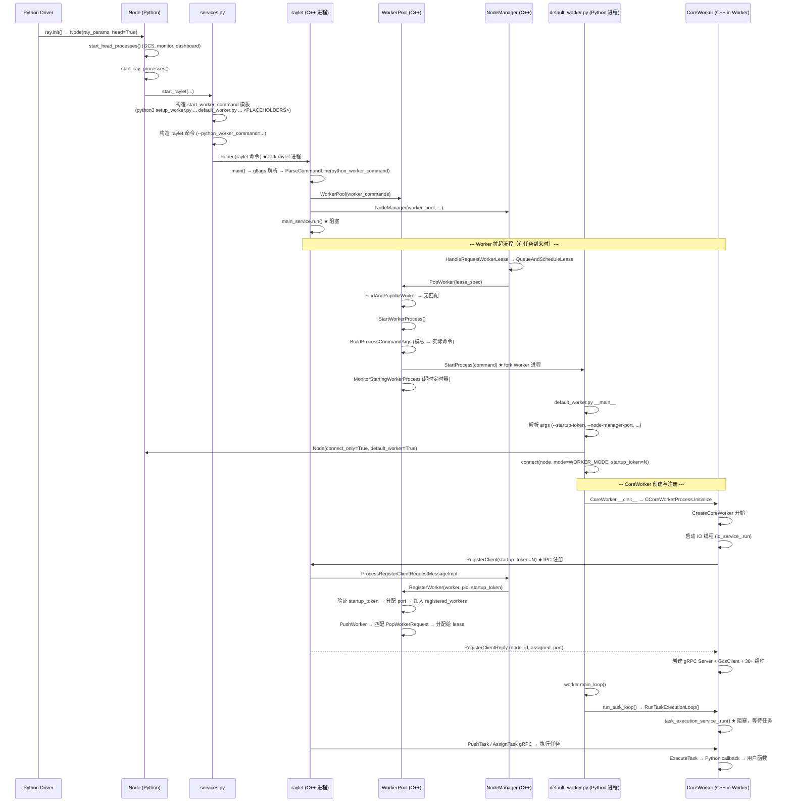

# Ray: Raylet 启动与 Worker/Actor 进程拉起完整流程

> 从 `ray.init()` 触发 raylet 启动，到 raylet 拉起一个新的 worker/actor 进程并完成注册的全链路解析。

---

## 1) 整体架构概览

Ray 的进程模型：

```
ray.init() (Python driver 进程)
  ├── Node (Python)           — 基础设施管理：启动 raylet、plasma store 等守护进程
  │     ├── raylet (C++ 进程)  — 本节点调度器 + worker 池管理 + 对象管理
  │     ├── plasma_store       — 共享内存对象存储
  │     ├── gcs_server         — 全局状态服务（仅 head node 启动）
  │     └── dashboard_agent    — 监控代理
  └── CoreWorker (C++ in-process) — 任务运行时：接收/执行任务、对象引用管理、gRPC 通信
      ├── io_service_ 线程      — IO 事件循环
      ├── task_execution_service_ 线程 — 任务执行循环（worker 主线程阻塞于此）
      └── TaskEventBuffer 线程  — 任务事件 flush
```

Worker/Actor 进程（由 raylet fork 出来）：

```
default_worker.py (Python 进程)
  ├── Node (Python, connect_only=True) — 只读取连接信息，不启动守护进程
  └── CoreWorker (C++ in-process)
      ├── 注册到 raylet（IPC）
      ├── 启动 gRPC server
      ├── 连接 GCS
      └── run_task_loop() → task_execution_service_.run() 阻塞
```

---

## 2) 第一阶段：raylet 进程的启动

### 2.1 调用链

```
ray.init()
  → worker.py: init() (line 1416)
    → node.py: Node(ray_params, head=True)
      → node.py: __init__ (line 64)
        → node.py: start_head_processes() (line 340)   # head node 特有
          → start_gcs_server / start_monitor / start_api_server
        → node.py: start_ray_processes() (line 343)
          → node.py: start_raylet() (line 1445)         # ★ 关键步骤
            → services.py: start_raylet() (line 1518)   # ★ 构造命令并启动进程
```

### 2.2 Node 的角色

`Node` (`python/ray/_private/node.py`) 是一个 Ray 节点的**基础设施管理器**，职责是启动和管理本节点的守护进程。

对于 **head node**（`ray.init()` 在 driver 进程中创建）：
- `head=True` → 先调用 `start_head_processes()`（启动 GCS server、monitor、dashboard 等）
- 然后调用 `start_ray_processes()`（启动 plasma store、raylet）

对于 **worker node**（`ray start` 命令创建）：
- `head=False` → 直接调用 `start_ray_processes()`（不启动 GCS 等 head-only 进程）

对于 **default_worker.py 进程**（raylet fork 出来的）：
- `connect_only=True, default_worker=True` → **不启动任何进程**，只从 GCS 读取 socket 信息
- `assert not self._default_worker` 出现在 head-only 的逻辑分支中

### 2.3 Node vs CoreWorker 的关系

| | Node (Python) | CoreWorker (C++) |
|---|---|---|
| **角色** | 节点基础设施管理器 | 进程内任务运行时 |
| **职责** | 启动/管理 raylet、plasma store、GCS 等守护进程；提供连接信息 | 接收/执行任务、管理对象引用、gRPC 通信 |
| **生命周期** | 随 `ray.init()` 或 `ray start` 创建 | 随 `connect()` 中 CoreWorker 构造创建 |
| **数量** | 每个节点一个 | 每个进程一个（driver 和 worker 都有） |

Node 是 CoreWorker 的**"接线员"**——提供本节点的基础设施连接信息：

```python
# worker.py: connect() 中 (line 2657)
worker.core_worker = ray._raylet.CoreWorker(
    mode,
    node.plasma_store_socket_name,   # Node 提供的 plasma socket
    node.raylet_socket_name,         # Node 提供的 raylet IPC socket
    job_id,
    gcs_options,
    ...
    node.node_ip_address,            # Node 提供的本节点 IP
    node.node_manager_port,          # Node 提供的 raylet 端口
    ...
)
```

CoreWorker 使用这些信息连接到 raylet（IPC）、Plasma Store（读写对象）和建立自己的 gRPC server。

---

## 3) 第二阶段：services.py 启动 raylet 进程

### 3.1 命令构造

`services.py: start_raylet()` (line 1518-1946) 构造 raylet 进程的完整命令行。

核心命令（line 1845-1876）：

```python
command = [
    RAYLET_EXECUTABLE,                    # C++ raylet 二进制
    f"--raylet_socket_name={raylet_name}",
    f"--store_socket_name={plasma_store_name}",
    f"--node_manager_port={node_manager_port}",
    f"--node_id={node_id}",
    f"--node_ip_address={node_ip_address}",
    f"--maximum_startup_concurrency={maximum_startup_concurrency}",
    f"--static_resource_list={resource_argument}",
    f"--python_worker_command={subprocess.list2cmdline(start_worker_command)}",  # ★
    f"--java_worker_command=...",
    f"--cpp_worker_command=...",
    f"--gcs-address={gcs_address}",
    f"--session-name={session_name}",
    f"--cluster-id={cluster_id}",
    ...
]
```

### 3.2 RAYLET_EXECUTABLE

```python
# services.py: line 58-60
RAYLET_EXECUTABLE = os.path.join(
    RAY_PATH, "core", "src", "ray", "raylet", "raylet" + EXE_SUFFIX
)
```

这是 Ray 编译产出的 C++ 二进制文件，路径类似 `.../ray/core/src/ray/raylet/raylet`。

### 3.3 python_worker_command 的构造

**这是 Python → C++ 串联的关键**。raylet 是 C++ 进程，它需要知道如何启动 Python worker，所以 Python 在启动 raylet 时把 worker 启动命令模板作为参数传入。

`start_worker_command` 的构造（services.py: line 1713-1736）：

```python
start_worker_command = [
    sys.executable,                        # e.g. "/usr/bin/python3"
    setup_worker_path,                     # setup_worker.py（runtime env 安装脚本）
    ... _site_flags(),                     # 继承当前解释器的 -S/-s 标志
    worker_path,                           # default_worker.py 的绝对路径 ★
    f"--node-ip-address={node_ip_address}",
    "--node-manager-port=RAY_NODE_MANAGER_PORT_PLACEHOLDER",  # ★ 占位符
    f"--object-store-name={plasma_store_name}",
    f"--raylet-name={raylet_name}",
    f"--redis-address={redis_address}",
    f"--gcs-address={gcs_address}",
    "RAY_WORKER_DYNAMIC_OPTION_PLACEHOLDER",  # ★ 占位符
    ...
]
```

其中 `worker_path` 在 `Node.__init__` (node.py: line 135-139) 中设定：

```python
ray_params.update_if_absent(
    worker_path=os.path.join(
        os.path.dirname(os.path.abspath(__file__)),
        "workers",
        "default_worker.py",       # ★ Python worker 入口文件
    ),
)
```

**两个占位符**：
- `RAY_NODE_MANAGER_PORT_PLACEHOLDER` — raylet 启动 worker 时替换为自己的实际端口（因为 raylet 启动时才知道自己的端口）
- `RAY_WORKER_DYNAMIC_OPTION_PLACEHOLDER` — raylet 根据任务需求插入 dynamic worker options（如 `@ray.remote(num_cpus=2)` 的资源配置）

最终通过 `subprocess.list2cmdline()` 序列化为一个字符串，作为 `--python_worker_command=` flag 传入 raylet 进程。

### 3.4 进程启动

```python
# services.py: line 1934-1946
process_info = start_ray_process(
    command,                                # 完整的 raylet 命令行
    ray_constants.PROCESS_TYPE_RAYLET,
    ...
)
```

`start_ray_process()` (services.py: line 797) 使用 `ConsolePopen`（即 `subprocess.Popen` 的封装）fork 出 raylet 子进程。

---

## 4) 第三阶段：raylet C++ 进程初始化

### 4.1 main() 入口

`src/ray/raylet/main.cc` (line 181)：

```cpp
int main(int argc, char *argv[]) {
    gflags::ParseCommandLineFlags(&argc, &argv, true);
    // ... 解析所有 flag ...
}
```

### 4.2 worker_command 的解析与存储

raylet 通过 gflags 接收 Python 传入的 worker 启动命令（line 246, 572-574）：

```cpp
const std::string python_worker_command = FLAGS_python_worker_command;

// ...
node_manager_config.worker_commands.emplace(
    make_pair(ray::Language::PYTHON, ParseCommandLine(python_worker_command)));
```

`ParseCommandLine()` 将序列化的字符串还原为 `vector<string>`。这个 map 最终传给 `WorkerPool` 构造函数，存储在每个语言的 `State.worker_command` 中。

### 4.3 WorkerPool 创建

main.cc (line 655-690)：

```cpp
worker_pool = std::make_unique<ray::raylet::WorkerPool>(
    main_service,
    raylet_node_id,
    ...
    node_manager_config.worker_commands,     // ★ worker 启动命令模板
    ...
);
```

`WorkerPool` 构造函数 (worker_pool.cc: line 85-100) 将 `worker_commands` 存入 `states_` map，每种语言有自己的 `State`，其中 `State.worker_command` 就是启动 worker 时使用的命令模板。

### 4.4 NodeManager 创建与事件循环启动

main.cc 继续创建 `NodeManager`、`ObjectManager` 等，然后 raylet 进入主事件循环：

```cpp
main_service.run();  // raylet 的 boost::asio IO 事件循环阻塞于此
```

---

## 5) 第四阶段：raylet 拉起新 Worker 进程

当有任务需要执行时，完整的 worker 拉起流程如下：

### 5.1 任务调度 → Worker Lease 请求

1. GCS 或本地调度器向 raylet 发送 `RequestWorkerLease` gRPC
2. `NodeManager::HandleRequestWorkerLease` (node_manager.cc: line 1778) 接收请求
3. 解析 `LeaseSpecification`，判断是否为 actor creation task
4. 调用 `cluster_lease_manager_.QueueAndScheduleLease()` 排队调度

### 5.2 调度 → PopWorker

5. 调度器调用 `WorkerPool::PopWorker(lease_spec, callback)` (worker_pool.cc: line 1394)
6. 创建 `PopWorkerRequest`，包含 language、worker_type、job_id、`is_actor_worker`（来自 `lease_spec.IsActorCreationTask()`）、runtime_env_hash 等

7. 先尝试从 **idle pool** 中找到匹配的已注册 worker (`FindAndPopIdleWorker`)，匹配条件包括 runtime_env_hash、job_id、dynamic_options 等

8. 如果 idle pool 中没有匹配的 worker，则调用 **StartWorkerProcess** 创建新进程

### 5.3 StartWorkerProcess：构造命令并启动进程

`WorkerPool::StartWorkerProcess` (worker_pool.cc: line 463-547)：

```cpp
std::tuple<Process, StartupToken> WorkerPool::StartWorkerProcess(
    const Language &language,
    const rpc::WorkerType worker_type,
    const JobID &job_id,
    PopWorkerStatus *status,
    ...) {
    // 1. 检查并发限制（maximum_startup_concurrency）
    // 2. 调用 BuildProcessCommandArgs 构造命令行
    auto [worker_command_args, env] = BuildProcessCommandArgs(...);
    // 3. StartProcess fork 子进程
    Process proc = StartProcess(worker_command_args, env);
    // 4. 生成 startup_token，监控注册超时
    MonitorStartingWorkerProcess(worker_startup_token_counter_, ...);
    // 5. 返回 (Process, StartupToken)
}
```

### 5.4 BuildProcessCommandArgs：从模板到实际命令

`BuildProcessCommandArgs` (worker_pool.cc: line 265-343) 从 `state.worker_command` 读出模板，逐 token 处理：

- 遇到 `kWorkerDynamicOptionPlaceholder` → 替换为 dynamic options + runtime env hash 等
- 遇到 `kNodeManagerPortPlaceholder` → 替换为 raylet 实际端口
- 附加 `--startup-token=<token>`、`--worker-launch-time-ms=<ms>`、`--runtime-env-hash=<hash>`、`--node-id=<hex>` 等

所以最终 raylet 启动 Python worker 的命令大致为：

```
/path/to/python3 /path/to/setup_worker.py -S ... \
    /path/to/default_worker.py \
    --node-ip-address=X.X.X.X \
    --node-manager-port=12345 \          # ★ 从占位符替换为实际端口
    --object-store-name=/tmp/plasma_store \
    --raylet-name=/tmp/raylet \
    --redis-address=... \
    --gcs-address=... \
    [dynamic_options...] \               # ★ 从占位符替换
    --startup-token=42 \                 # ★ raylet 生成
    --worker-launch-time-ms=... \
    --runtime-env-hash=123 \
    --node-id=abcdef \
    --cluster-id=... \
    --session-name=...
```

### 5.5 StartProcess：fork 子进程

`StartProcess` (worker_pool.cc: line 636-693) 使用 `Process` 类 fork 子进程：

```cpp
Process child(argv.data(),
              io_service_,
              ec,
              /*decouple=*/false,
              env,
              /*pipe_to_stdin=*/false,
              add_to_cgroup_hook_,
              new_process_group);
```

- 设置独立 process group（便于 killpg 清理）
- 可选 cgroup 资源隔离
- 注册超时定时器：如果 worker 在 `worker_register_timeout_seconds` 内没完成注册，raylet kill 进程

### 5.6 setup_worker.py → default_worker.py 的衔接

raylet 先启动 `setup_worker.py`（runtime env 安装脚本），完成环境安装后，`setup_worker.py` 通过 `execv` 替换进程映像为 `default_worker.py`，这样 worker 进程 PID 不变，但执行的代码从 setup 脚本变为正式的 worker 入口。

---

## 6) 第五阶段：Python Worker 进程初始化

新进程启动后执行 `default_worker.py` (python/ray/_private/workers/default_worker.py)：

### 6.1 入口流程

```python
if __name__ == "__main__":
    args = parser.parse_args()                    # 解析 raylet 传入的命令行参数
    # --startup-token, --node-manager-port, --runtime-env-hash, ...

    mode = ray.WORKER_MODE                        # Worker 类型

    try_install_uvloop()                           # 可选：安装 uvloop

    ray_params = RayParams(...)                    # 构造参数
    node = ray._private.node.Node(                 # ★ 创建 Node（connect_only=True）
        ray_params,
        head=False,
        shutdown_at_exit=False,
        spawn_reaper=False,
        connect_only=True,                         # ★ 只连接，不启动守护进程
        default_worker=True,                        # ★ 标记为 default worker
    )

    ray._private.worker.connect(                   # ★ 创建 CoreWorker 并注册到 raylet
        node,
        node.session_name,
        mode=mode,
        runtime_env_hash=args.runtime_env_hash,
        startup_token=args.startup_token,
        ...
    )

    worker = ray._private.worker.global_worker

    # 设置日志、preload modules、setup hook 等

    worker.main_loop()                             # ★ 进入任务执行循环
```

### 6.2 Node 在 Worker 进程中的角色

Worker 进程中的 Node 是"轻量的"——`connect_only=True, default_worker=True`：
- **不启动** raylet、plasma store 等守护进程
- **只从 GCS 读取** 已有节点的 socket 信息（plasma_store_socket_name、raylet_socket_name、node_manager_port）
- 提供 CoreWorker 需要的连接参数

---

## 7) 第六阶段：CoreWorker 创建与 Raylet 注册

### 7.1 connect() → CoreWorker 创建

`worker.py: connect()` (line 2444) 中创建 CoreWorker Cython 实例 (line 2657)：

```python
worker.core_worker = ray._raylet.CoreWorker(
    mode,                                   # WORKER_MODE
    node.plasma_store_socket_name,          # Node 提供的 plasma socket
    node.raylet_socket_name,                # Node 提供的 raylet IPC socket
    job_id,                                 # JobID.nil()（worker 模式）
    gcs_options,
    logs_dir,
    node.node_ip_address,
    node.node_manager_port,
    (mode == LOCAL_MODE),                   # False
    driver_name,
    serialized_job_config,
    node.metrics_agent_port,
    runtime_env_hash,
    startup_token,                          # ★ raylet 分配的唯一标识
    session_name,
    node.cluster_id.hex(),
    ...
)
```

### 7.2 C++ CoreWorkerProcessImpl::CreateCoreWorker 初始化序列

`core_worker_process.cc` (line 135-694) 严格按序执行：

1. **启动 IO 线程**（line 184）— `io_service_.run()` 在 `io_thread_` 上运行
2. **通过 IPC 向 Raylet 注册**（line 207-221）— `raylet_ipc_client->RegisterClient()`
   - 发送 `RegisterClientRequest`，携带 `startup_token`
   - 注册成功后获得 `local_node_id` 和 `assigned_port`（raylet 分配的 gRPC 端口）
3. **创建 gRPC Server**（line 243-253）
4. **创建 GcsClient 并连接**（line 266-268）
5. **创建 TaskEventBuffer 并启动**（line 270-274）
6. ...（30+ 其他组件初始化）
7. **CoreWorker 构造**（line 661-692）

**关键顺序约束**：
- IO 线程必须先启动（后续注册和 RPC 都依赖 `io_service_`）
- Raylet 注册必须在 gRPC Server 启动后（raylet 注册后会立即开始向 CoreWorker 发送 RPC）

### 7.3 Raylet 处理注册请求

Raylet 收到 IPC `RegisterClientRequest` 后：

`NodeManager::ProcessRegisterClientRequestMessageImpl` (node_manager.cc: line 1177-1251)：

1. 解析 startup_token、worker_id、pid、worker_type 等
2. 创建 `Worker` 对象 (line 1198-1207)
3. 调用 `WorkerPool::RegisterWorker` (worker_pool.cc: line 788-843)：
   - 验证 startup_token 是否匹配已启动的进程
   - 分配 gRPC 端口（`GetNextFreePort`）
   - 将 worker 加入 `registered_workers`
   - 发送 `RegisterClientReply`（包含 node_id 和 assigned_port）

4. 注册完成后 `WorkerPool::PushWorker` (worker_pool.cc: line 1088-1155) 尝试匹配 pending 的 `PopWorkerRequest`：
   - 如果匹配到 lease 请求 → worker 被分配给该 lease（becomes leased worker）
   - 如果没有匹配 → worker 进入 idle pool

---

## 8) 第七阶段：Worker 进入任务执行循环

### 8.1 main_loop → run_task_loop

```python
# worker.py: line 1021-1032
def main_loop(self):
    ray._private.utils.set_sigterm_handler(sigterm_handler)
    self.core_worker.run_task_loop()     # ★ Python 主线程阻塞于此
    sys.exit(0)
```

### 8.2 C++ RunTaskExecutionLoop

`core_worker.cc` (line 2693-2723)：

```cpp
void CoreWorker::RunTaskExecutionLoop() {
    // 在 task_execution_service_ 上运行
    task_execution_service_.run();       // ★ 阻塞在此
}
```

Python 主线程从此**不再执行用户代码**，而是阻塞在 `task_execution_service_.run()` 上，等待 raylet 通过 gRPC 分发任务。

---

## 9) Actor vs 普通 Worker 的关键区别

- **进程入口完全相同**：Actor 和普通 task worker 都使用 `default_worker.py`，走同样的注册流程
- **区别在 lease 分配时**：
  - `PopWorkerRequest` 的 `is_actor_worker` 字段为 `true` 时，匹配逻辑不同（考虑 `root_detached_actor_id` 等）
  - Actor worker 被分配后不会再回到 idle pool — actor 是"一次性"的，创建后绑定到该 actor 直到死亡
  - Actor worker 执行的第一个任务是 **actor creation task**（调用 `__init__`），之后所有任务都是 actor method calls
  - Actor worker 的 `CheckSignal` 周期任务（10ms）检查 `worker_context_->GetCurrentActorShouldExit()` 判断是否应退出

---

## 10) 关键源码索引

### Python 端

| 文件 | 关键位置 | 说明 |
|------|---------|------|
| `python/ray/_private/services.py` | line 58-60 | `RAYLET_EXECUTABLE` 定义（C++ 二进制路径） |
| `python/ray/_private/services.py` | line 1518-1946 | `start_raylet()` — 构造命令并启动 raylet 进程 |
| `python/ray/_private/services.py` | line 1713-1736 | `start_worker_command` 构造（worker 启动命令模板） |
| `python/ray/_private/services.py` | line 1845-1876 | raylet 命令行构造（包含 `--python_worker_command` flag） |
| `python/ray/_private/services.py` | line 1934-1946 | `start_ray_process()` — Popen 启动 raylet 子进程 |
| `python/ray/_private/services.py` | line 797-999 | `start_ray_process()` — 通用进程启动函数 |
| `python/ray/_private/node.py` | line 135-139 | `worker_path` = `default_worker.py` 的绝对路径 |
| `python/ray/_private/node.py` | line 1160-1445 | `Node.start_raylet()` → 调用 `services.start_raylet()` |
| `python/ray/_private/node.py` | line 1357-1365 | `Node.start_head_processes()` — head node 特有 |
| `python/ray/_private/node.py` | line 1386-1445 | `Node.start_ray_processes()` — 启动 plasma + raylet |
| `python/ray/_private/node.py` | line 330-343 | `Node.__init__` 中调用启动流程 |
| `python/ray/_private/workers/default_worker.py` | line 202-329 | Worker 进程入口 |
| `python/ray/_private/workers/default_worker.py` | line 265-274 | `ray._private.worker.connect()` — 创建 CoreWorker 并注册 |
| `python/ray/_private/workers/default_worker.py` | line 321-322 | `worker.main_loop()` — 进入任务执行循环 |
| `python/ray/_private/worker.py` | line 2444 | `connect()` 函数定义 |
| `python/ray/_private/worker.py` | line 2657-2678 | CoreWorker Cython 实例创建 |

### C++ 端（raylet）

| 文件 | 关键位置 | 说明 |
|------|---------|------|
| `src/ray/raylet/main.cc` | line 67-129 | gflags 定义（`--python_worker_command` 等） |
| `src/ray/raylet/main.cc` | line 181 | `main()` 入口 |
| `src/ray/raylet/main.cc` | line 572-574 | `ParseCommandLine(python_worker_command)` → `worker_commands` map |
| `src/ray/raylet/main.cc` | line 655-690 | `WorkerPool` 创建（传入 `worker_commands`） |
| `src/ray/raylet/worker_pool.cc` | line 85-100 | `WorkerPool` 构造函数（接收 `worker_commands`） |
| `src/ray/raylet/worker_pool.cc` | line 463-547 | `StartWorkerProcess` — 构造命令并 fork |
| `src/ray/raylet/worker_pool.cc` | line 265-343 | `BuildProcessCommandArgs` — 从模板到实际命令 |
| `src/ray/raylet/worker_pool.cc` | line 636-693 | `StartProcess` — fork 子进程 |
| `src/ray/raylet/worker_pool.cc` | line 570-612 | `MonitorStartingWorkerProcess` — 注册超时监控 |
| `src/ray/raylet/worker_pool.cc` | line 788-843 | `RegisterWorker` — 处理 worker 注册请求 |
| `src/ray/raylet/worker_pool.cc` | line 1088-1155 | `PushWorker` — 注册后匹配 lease 请求或放入 idle pool |
| `src/ray/raylet/worker_pool.cc` | line 1394-1431 | `PopWorker(lease_spec)` — 从 pool 获取 worker |
| `src/ray/raylet/worker_pool.cc` | line 1433-1473 | `FindAndPopIdleWorker` — 从 idle pool 查找匹配 worker |
| `src/ray/raylet/node_manager.cc` | line 1177-1251 | `ProcessRegisterClientRequestMessageImpl` — 处理注册 |
| `src/ray/raylet/node_manager.cc` | line 1778-1879 | `HandleRequestWorkerLease` — 处理 lease 请求 |

### C++ 端（CoreWorker）

| 文件 | 关键位置 | 说明 |
|------|---------|------|
| `src/ray/core_worker/core_worker_process.cc` | line 135-694 | `CreateCoreWorker` 完整初始化序列 |
| `src/ray/core_worker/core_worker_process.cc` | line 184-196 | IO 线程启动 |
| `src/ray/core_worker/core_worker_process.cc` | line 207-227 | Raylet IPC 注册 |
| `src/ray/core_worker/core_worker.cc` | line 2693-2723 | `RunTaskExecutionLoop()` |

---

## 11) 完整时序图



---

## 12) Python → C++ 串联总结

Python 和 C++ 的串联依赖**两个桥梁**：

### 桥梁一：命令行参数传递

```
Python (services.py)                    C++ (raylet main.cc)
─────────────────────                  ──────────────────────
start_worker_command                    FLAGS_python_worker_command
  (模板，含占位符)                    → ParseCommandLine()
                                        → worker_commands map
                                          → WorkerPool.State.worker_command
                                            → BuildProcessCommandArgs
                                              → StartProcess(fork)
```

Python 在启动 raylet 时，把"如何启动 Python worker"的完整命令模板作为 `--python_worker_command` 传入。raylet 是 C++ 进程，它不知道 Python 的存在，但它保存了这个命令模板。当需要 worker 时，raylet 从模板中替换占位符、附加参数，然后 fork 出子进程执行这个命令。

### 桥梁二：IPC 注册 + startup_token

```
Raylet (C++)                           CoreWorker (C++ in Python Worker)
─────────────────                      ────────────────────────────────
StartWorkerProcess                     raylet_ipc_client->RegisterClient()
  → 生成 startup_token=N              → 传入 startup_token=N (从命令行 args)
  → 写入命令行 --startup-token=N
  → 等待注册（超时监控）

RegisterWorker()
  → 验证 startup_token 匹配
  → 分配 gRPC 端口
  → 回复 RegisterClientReply
```

`startup_token` 是 raylet 与新 worker 之间的"握手令牌"——raylet 在启动 worker 时生成 token 并写入命令行参数，worker 启动后用这个 token 向 raylet 注册。raylet 通过 token 将 fork 出的进程与注册请求对应起来。