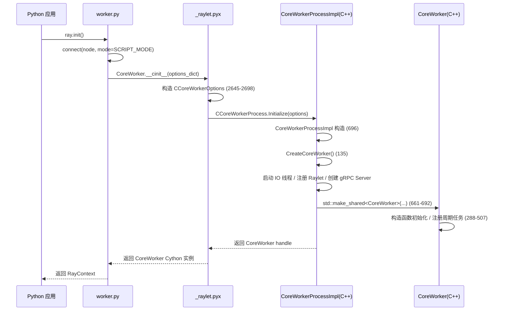
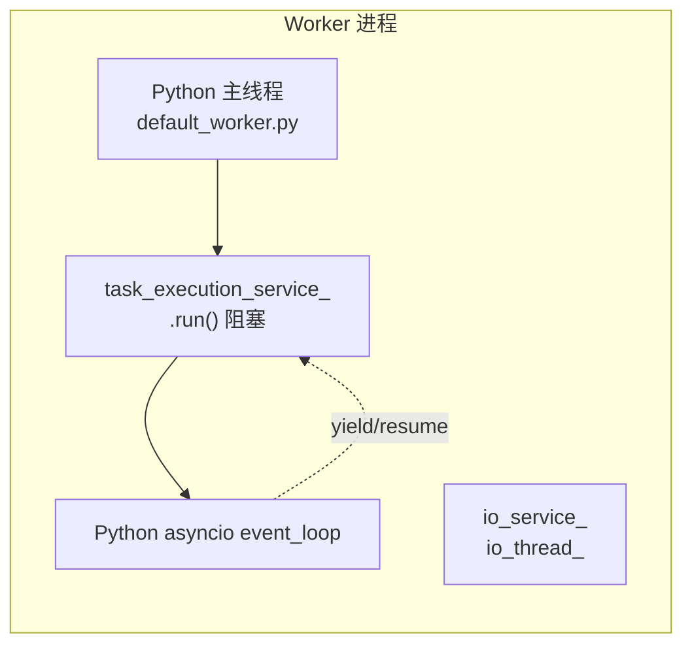
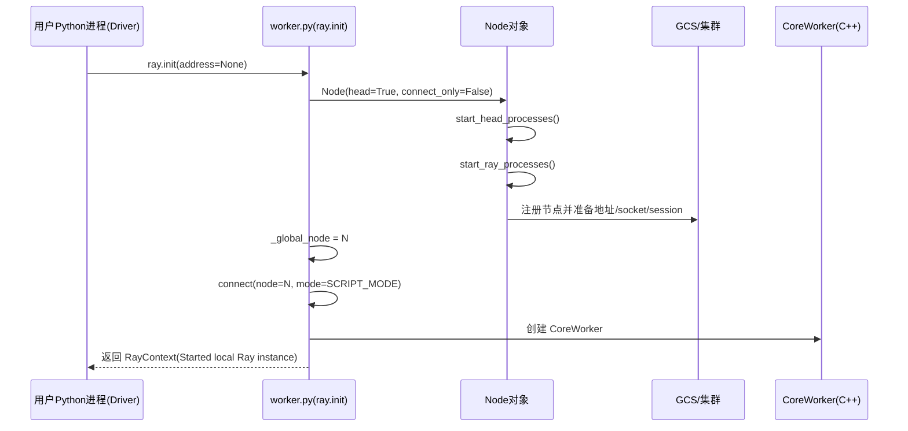
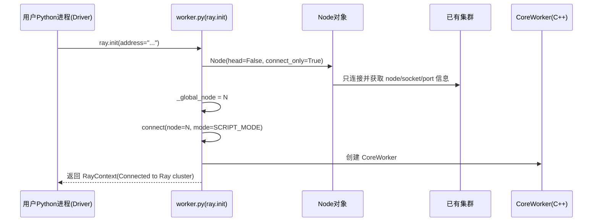
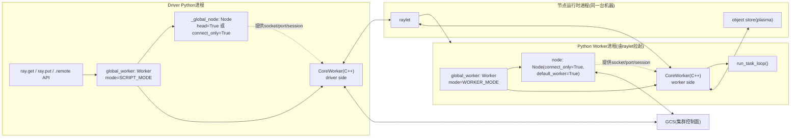

# Core Concepts/Components

## 1.1 `ray._private.worker.Worker`

`Worker` 是当前 Python 进程的 Ray 执行上下文控制器（不是集群 worker 著节点），代表进程内控制面。Driver 和 Worker 进程各有一个 `global_worker` 单例（`Worker` 实例），但运行模式不同（`SCRIPT_MODE` vs `WORKER_MODE`）。

### 核心字段

| 字段 | 类型 | 说明 |
|------|------|------|
| `node` | `Node` | 本进程节点运行时句柄，提供 IP / socket / session 等基础设施信息 |
| `mode` | `SCRIPT_MODE / WORKER_MODE / LOCAL_MODE` | 运行模式：Driver=SCRIPT_MODE，Worker=WORKER_MODE，本地调试=LOCAL_MODE |
| `core_worker` | C++ CoreWorker (Cython) | C++ 运行时实例，负责任务执行 / 对象管理 / gRPC 通信（`connect()` 中创建） |
| `actors` | `dict` | 当前进程持有的 actor 实例映射 |
| `_gpu_object_manager` | `GPUObjectManager` | GPU 对象生命周期管理（out-of-band tensor 传输），懒加载创建 |
| `original_visible_accelerator_ids` | `dict` | 进程启动时原始可见加速器 ID（CUDA / HIP / NEURON 等），用于资源分配时约束 |
| `serialization_context_map` | `dict[JobID → SerializationContext]` | 按 job ID 管理序列化上下文，跨 job 隔离 |
| `function_actor_manager` | `FunctionActorManager` | 远程函数 / actor 的动态导入与注册管理 |
| `threads_stopped` | `threading.Event` | 全进程线程退出信号，所有线程定期检查 |
| `_is_connected` | `bool` | 是否已连接 Ray 集群（`connect()` 中设为 True，`disconnect()` 中设为 False） |
| `_cached_job_id` | `JobID` | 缓存当前 job ID，优化 `ray.get()/put()` 热路径查询 |

### 运行模式差异

- **SCRIPT_MODE (Driver)**：Python 主线程执行用户代码，`ray.get()` 在 C++ 侧阻塞等待；不接收 raylet 分配的任务（无 `task_receiver_`）。
- **WORKER_MODE (Worker)**：Python 主线程阻塞在 `core_worker.run_task_loop()` → C++ `task_execution_service_.run()`；通过 `TaskReceiver` 接收并执行 raylet 分配的任务。
- **LOCAL_MODE**：本地调试模式，远程调用退化为同步执行，不经过 raylet 调度。

### 关键方法

| 方法 | 说明 |
|------|------|
| `put_object()` | 将值写入本地对象存储（Plasma / MemoryStore），支持 GPU object out-of-band 传输 |
| `get_objects()` | 从对象存储读取值，阻塞直到可用；支持 debugger breakpoint 检测和 GPU tensor 获取 |
| `main_loop()` | Worker 进程主循环入口：设置 SIGTERM handler → `core_worker.run_task_loop()` → `sys.exit(0)` |
| `print_logs()` | Driver 侧订阅 GCS 日志并转发到本地 stdout/stderr |
| `get_serialization_context()` | 获取当前 job 的序列化上下文（RLock 保护，支持递归调用） |

---

## 1.2 `ray.CoreWorker` (C++)

CoreWorker 是 Ray 中每个 Python 进程（driver 或 worker）的核心 C++ 运行时。每个进程有且仅有一个 CoreWorker 实例，负责：

- **任务执行**：接收并执行 raylet 分发的任务（仅 worker 模式）
- **对象管理**：Plasma Store 读写、内存存储、引用计数
- **集群通信**：与 GCS、raylet、其他 CoreWorker 的 gRPC 交互
- **事件报告**：TaskEventBuffer 定期向 GCS / Event Aggregator 推送任务状态

详细架构见下文第 2–8 节。

---

## 1.3 `ray._private.node.Node`

`Node` 不是集群级物理节点对象，而是**当前 Python 进程内的节点级运行时句柄**，用于：

- 启动/停止本机 Ray 进程（`connect_only=False` 时启动 raylet / plasma / GCS 等）
- 或仅连接到已有集群并读取节点地址信息（`connect_only=True` 时）
- 管理 session 目录、socket、日志、端口、GCS 连接等节点基础设施

简而言之，Node 是基础设施提供者，Worker 是计算执行者。Worker 持有 Node 就像工人需要知道工厂的位置、设备和入口一样——Worker 必须通过 Node 才能找到本节点上的 raylet、Plasma Store 等服务来工作。

1. 初始化 CoreWorker 时需要节点信息：就是你之前看到的那行 `ray._raylet.CoreWorker(...)` 调用，它的参数（plasma socket、raylet socket、node IP、manager port）全部来自 node
2. 获取节点资源信息：如 worker.node.get_resource_and_label_spec() 来查询 GPU 数量等
3. 获取运行环境路径：如 worker.node.get_runtime_env_dir_path()
4. GCS 客户端：worker.gcs_client = node.get_gcs_client()
5. 节点 IP/标签：worker.node_ip_address、worker.current_node_labels 等属性都委托给 node

详细定位与 `ray.init()` 时序图见 [ray_node_worker_role_and_sequences.md](ray_node_worker_role_and_sequences.md)。


# Python CoreWorker 完整启动流程与事件循环机制详解

> 本文档深入 `ray.init()` 以下的 C++ CoreWorker 创建、IO 线程与事件驱动架构。
> Node / Worker 角色定位和 `ray.init()` 高层时序图已在 [ray_node_worker_role_and_sequences.md](ray_node_worker_role_and_sequences.md) 中覆盖，此处不再重复。

---

## 2) 概述

CoreWorker 的职责与定位已在 §1.2 覆盖，本节起直接进入 C++ 侧的实现细节。

CoreWorker 由 `CoreWorkerProcess`（进程级单例工厂）创建和管理，整体架构是**多线程 + 多 io_context** 的事件驱动模型。

---

## 2) Python → C++ 桥接链路

### 2.1 调用链

```
ray.init()
  → worker.py: connect() (line 2444)
    → worker.py: 创建 CoreWorker Cython 实例
      → _raylet.pyx: CoreWorker.__cinit__ (line 2634)
        → 构造 CCoreWorkerOptions (line 2645-2698)
        → CCoreWorkerProcess.Initialize(options) (line 2699)
          → core_worker_process.cc: CoreWorkerProcess::Initialize() (line 87)
            → 创建 CoreWorkerProcessImpl(options) (line 696)
              → CoreWorkerProcessImpl::CreateCoreWorker() (line 135)
```

### 2.2 Options 从 Python 到 C++

`_raylet.pyx` (line 2645-2698) 将 Python 参数逐字段映射到 `CCoreWorkerOptions`：

| Python 参数 | C++ 字段 | 行号 | 说明 |
|-------------|----------|------|------|
| worker_type | `WORKER_TYPE_DRIVER` / `WORKER_TYPE_WORKER` | 2648/2651 | DRIVER=SCRIPT_MODE, WORKER=WORKER_MODE |
| language | `LANGUAGE_PYTHON` | 2660 | 固定为 Python |
| store_socket | `store_socket` | 2661 | Plasma store socket |
| raylet_socket | `raylet_socket` | 2662 | Raylet IPC socket |
| job_id | `job_id` | 2664 | Job ID |
| serialized_job_config | `serialized_job_config` | 2667 | 序列化的 JobConfig |
| node_ip_address | `node_ip_address` | 2670 | 本节点 IP |
| metrics_agent_port | `metrics_agent_port` | 2673 | Dashboard agent port |
| session_name | `session_name` | 2675 | Session 名称 |
| task_execution_callback | `execute_task` | 2680 | Python 回调（执行任务） |
| check_signals | `check_signals` | 2682 | 信号检查回调 |
| ... | ... | ... | 其他 30+ 字段 |

### 2.3 时序图



---

## 3) CoreWorkerProcessImpl 构造与 CreateCoreWorker 序列

### 3.1 CoreWorkerProcessImpl 构造函数

`core_worker_process.cc` (line 696-705)：

```cpp
CoreWorkerProcessImpl::CoreWorkerProcessImpl(const CoreWorkerOptions &options)
    : options_(options),
      worker_id_(options.worker_type == WorkerType::DRIVER
                     ? ComputeDriverIdFromJob(options_.job_id)
                     : WorkerID::FromRandom()),
      io_work_(io_service_.get_executor()),          // 防止 io_service_ 自动退出
      client_call_manager_(std::make_unique<rpc::ClientCallManager>(
          io_service_, /*record_stats=*/false, options.node_ip_address)),
      task_execution_service_work_(task_execution_service_.get_executor()), // 防止 task_execution_service_ 自动退出
      service_handler_(std::make_unique<CoreWorkerServiceHandlerProxy>()) {
  // ... 日志初始化 ...
}
```

关键点：
- `io_work_` 和 `task_execution_service_work_` 是 `boost::asio::make_work_guard` 的结果，确保对应的 `io_context::run()` 即使没有待处理任务也不会退出。
- `ClientCallManager` 管理所有出站 gRPC 调用，内部持有多个 `grpc::CompletionQueue` 和 polling threads。
- Driver 的 `worker_id_` 由 `job_id` 确定性计算；Worker 的 `worker_id_` 随机生成。

### 3.2 CreateCoreWorker 初始化序列

`core_worker_process.cc` (line 135-694) 严格按以下顺序执行：

```mermaid
flowchart TD
    A1["1. PeriodicalRunner::Create(io_service_)<br/>line 138"] --> A2
    A2["2. WorkerContext 创建<br/>line 139-140"] --> A3
    A3["3. TaskEventBuffer 创建<br/>line 167-171"] --> A4
    A4["4. IO 线程启动<br/>io_service_.run() on io_thread_<br/>line 184-196"] --> A5
    A5["5. Raylet IPC 注册<br/>RegisterClient → 获得 node_id + port<br/>line 207-227"] --> A6
    A6["6. gRPC Server 创建 + RegisterService + Run<br/>line 243-253"] --> A7
    A7["7. GcsClient 创建 + Connect<br/>line 266-268"] --> A8
    A8["8. TaskEventBuffer::Start()<br/>line 270-274"] --> A9
    A9["9. RayletClientPool + CoreWorkerClientPool<br/>line 276-299"] --> A10
    A10["10. PubSub Publisher/Subscriber<br/>line 301-323"] --> A11
    A11["11. ReferenceCounter<br/>line 325-335"] --> A12
    A12["12. LeaseRequestRateLimiter<br/>line 336-347"] --> A13
    A13["13. PlasmaClient + PlasmaStoreProvider<br/>line 354-368"] --> A14
    A14["14. CoreWorkerMemoryStore<br/>line 369-393"] --> A15
    A15["15. TaskManager<br/>line 423-480"] --> A16
    A16["16. ActorCreator + ActorTaskSubmitter<br/>line 499-515"] --> A17
    A17["17. NormalTaskSubmitter<br/>line 538-561"] --> A18
    A18["18. ObjectRecoveryManager<br/>line 638-654"] --> A19
    A19["19. CoreWorker 构造<br/>std::make_shared&lt;CoreWorker&gt;()<br/>line 661-692"]

    style A4 fill:#f9f,stroke:#333
    style A5 fill:#ff9,stroke:#333
    style A6 fill:#ff9,stroke:#333
    style A7 fill:#ff9,stroke:#333
    style A19 fill:#9f9,stroke:#333
```



关键依赖关系：
- **IO 线程必须先启动**（line 173 注释："Start the IO thread first to make sure the checker is working"），因为后续的 Raylet 注册和 gRPC Server 都依赖 `io_service_` 在运行。
- **Raylet 注册必须在 gRPC Server 启动之后**（line 231 注释），因为 raylet 注册后会立即开始发送 RPC 到 CoreWorker。
- **TaskEventBuffer::Start() 在 GcsClient 连接之后**，因为它需要 GcsClient 来发送事件。

### 3.3 IO 线程启动细节

`core_worker_process.cc` (line 184-196)：

```cpp
io_thread_ = boost::thread(io_thread_attrs, [this]() {
#ifndef _WIN32
    // Block SIGINT and SIGTERM so they will be handled by the main thread.
    sigset_t mask;
    sigemptyset(&mask);
    sigaddset(&mask, SIGINT);
    sigaddset(&mask, SIGTERM);
    pthread_sigmask(SIG_BLOCK, &mask, nullptr);
#endif
    SetThreadName("worker.io");
    io_service_.run();
    RAY_LOG(INFO) << "Core worker main io service stopped.";
});
```

- macOS 上增加栈大小到 16MB（line 182），因为 IO 线程会通过 Cython 执行 Python 代码，numpy 等库需要大栈。
- 阻塞 SIGINT/SIGTERM，确保信号由 Python 主线程处理。
- 线程名设为 `"worker.io"`，便于调试。

---

## 4) CoreWorker 构造函数内部初始化

`core_worker.cc` (line 288-507)

### 4.1 参数注入

CoreWorker 构造函数接收 30+ 个依赖（line 288-320），全部由 `CreateCoreWorker` 预创建后 `std::move` 注入。构造函数体（line 321-372）仅为成员赋值，不做额外初始化逻辑。

### 4.2 TaskReceiver 创建（仅 WORKER 模式）

line 375-398：

```cpp
if (options_.worker_type == WorkerType::WORKER || options_.is_local_mode) {
    RAY_CHECK(options_.task_execution_callback != nullptr);
    auto execute_task = std::bind(&CoreWorker::ExecuteTask, this, ...);
    task_argument_waiter_ = std::make_unique<DependencyWaiterImpl>(...);
    task_receiver_ = std::make_unique<TaskReceiver>(
        task_execution_service_, *task_event_buffer_, execute_task, ...);
}
```

- `TaskReceiver` 挂在 `task_execution_service_` 上，接收来自 raylet 的任务分配 gRPC。
- `execute_task` 绑定到 `CoreWorker::ExecuteTask`，最终回调到 Python 的 `task_execution_callback`。

### 4.3 GCS 注册与节点变化订阅

```cpp
RegisterToGcs(options_.worker_launch_time_ms, options_.worker_launched_time_ms);  // line 400
SubscribeToNodeChanges();  // line 402
```

- `RegisterToGcs`：向 GCS 注册 worker 信息（IP、端口、job ID 等），是其他组件发现本 worker 的前提。
- `SubscribeToNodeChanges`：订阅 GCS 的节点增/删事件，维护 `raylet_client_pool_` 的可用节点列表。

### 4.4 Driver task entry 创建（仅 DRIVER 模式）

line 410-440：Driver 会创建一个虚拟 driver task（`TaskID::ForDriverTask`），状态设为 `RUNNING`，并写入 TaskEventBuffer。这使 driver 的错误可以被上报（如对象 evicted 且无法重建）。

### 4.5 周期性任务注册

见下一节详细表格。

---

## 5) 周期性任务一览

所有通过 `PeriodicalRunner::RunFnPeriodically` 注册的周期任务：

### 5.1 CoreWorker 主周期任务

| 任务 | 行号 (core_worker.cc) | 间隔 | 仅 Worker? | 说明 |
|------|----------------------|------|-----------|------|
| `ExitIfParentRayletDies` | 443-446 | `raylet_death_check_interval_milliseconds()` | Yes | 通过 raylet IPC 检查 raylet 进程是否存活，死亡则 worker 自行退出 |
| `PrintEventStats` | 453-466 | `event_stats_print_interval_ms()` | No | 打印 `io_service_` 和 `task_execution_service_` 的 ASIO 统计 + TaskEventBuffer debug string；仅在 `event_stats` 配置启用时生效 |
| `RecoverObjects` | 468-492 | 100ms（硬编码） | No | 从 `reference_counter_` 获取待恢复对象列表，调用 `object_recovery_manager_->RecoverObject()` |
| `InternalHeartbeat` | 494-497 | `core_worker_internal_heartbeat_ms()` | No | 内部心跳：处理 pending tasks、清理过期状态 |
| `RecordMetrics` | 499-502 | `metrics_report_interval_ms() / 2` | No | 记录 Prometheus 指标 |
| `TryDelPendingObjectRefStreams` | 504-507 | `local_gc_min_interval_s() * 1000` ms | No | 清理已结束的 generator 的 pending ObjectRef 流 |

### 5.2 RunTaskExecutionLoop 内的周期任务

| 任务 | 行号 (core_worker.cc) | 间隔 | 仅 Worker? | 说明 |
|------|----------------------|------|-----------|------|
| `CheckSignal` | 2696-2718 | 10ms（硬编码） | Yes | 检查 `worker_context_->GetCurrentActorShouldExit()` 和 `options_.check_signals()`，决定 actor 是否应退出 |

此任务挂在 `task_execution_service_` 上的独立 `PeriodicalRunner`（line 2694），与主 PeriodicalRunner 不同。

### 5.3 TaskEventBuffer 的周期 flush

`task_event_buffer.cc` (line 481-483)：

```cpp
periodical_runner_->RunFnPeriodically(
    [this] { FlushEvents(/*forced=*/false); },
    report_interval_ms,
    "CoreWorker.deadline_timer.flush_task_events");
```

- 间隔：`task_events_report_interval_ms`（默认 1000ms）
- 挂在 TaskEventBuffer 自己的 `io_service_` 上（独立线程）
- 当 GCS / Event Aggregator 上一次请求未完成时，跳过本次 flush 并打印 WARNING 日志

### 5.4 PeriodicalRunner 机制

`PeriodicalRunner` (`src/ray/common/asio/periodical_runner.h`) 基于 `boost::asio::deadline_timer`：

- 每次 `RunFnPeriodically(fn, interval_ms, name)` 创建一个 `deadline_timer`，挂在目标 `io_context` 上。
- Timer 到期时执行 `fn`，然后重新设置下一个 timer（周期循环）。
- `PeriodicalRunner` 析构时自动取消所有 timer。
- 支持 `instrumented_io_context` 以收集事件统计（每个 task 的执行次数和耗时）。

---

## 6) 事件循环架构总览

### 6.1 三个独立 io_context

```mermaid
graph TB
    subgraph "CoreWorker 进程"
        direction TB

        subgraph "IO 线程 (io_thread_)"
            IO_SVC["io_service_"]
            IO_TASKS["PeriodicalRunner 主周期任务<br/>GCS/Raylet gRPC 回调<br/>ReferenceCounter 操作<br/>PubSub 消息<br/>MemoryStore 异步通知"]
        end

        subgraph "任务执行线程"
            TASK_SVC["task_execution_service_"]
            TASK_TASKS["RunTaskExecutionLoop()<br/>TaskReceiver 接收任务<br/>CheckSignal (10ms)<br/>Actor execute_task 回调"]
        end

        subgraph "TaskEventBuffer 线程"
            TEB_SVC["TaskEventBuffer::io_service_"]
            TEB_TASKS["FlushEvents 周期 flush<br/>GcsClient 事件发送<br/>EventAggregatorClient 发送"]
        end
    end

    subgraph "gRPC Polling 线程 (ClientCallManager)"
        CQ["CompletionQueue (×N)<br/>round-robin 分配"]
        CQ_TASKS["出站 gRPC 响应轮询<br/>收到响应后 post 回调到 io_service_"]
    end

    subgraph "Python 主线程 (Driver)"
        PY_MAIN["用户代码执行<br/>ray.get → C++ 阻塞等待"]
    end

    IO_TASKS --> IO_SVC
    TASK_TASKS --> TASK_SVC
    TEB_TASKS --> TEB_SVC
    CQ_TASKS --> CQ
    CQ -.post 回调.-> IO_SVC

    PY_MAIN -.ray.get/ray.wait 阻塞.-> IO_SVC

    style IO_SVC fill:#f9f,stroke:#333
    style TASK_SVC fill:#9ff,stroke:#333
    style TEB_SVC fill:#ff9,stroke:#333
    style CQ fill:#f99,stroke:#333
```

### 6.2 io_context 功能分配

| io_context | 运行线程 | 创建位置 | 核心职责 |
|------------|---------|---------|---------|
| `io_service_` | `io_thread_`（"worker.io"） | `CoreWorkerProcessImpl` 构造 (696) | 主 IO：GCS/Raylet RPC 回调、PeriodicalRunner、引用计数、PubSub |
| `task_execution_service_` | 调用 `RunTaskExecutionLoop()` 的线程（对 Worker 是主线程） | `CoreWorkerProcessImpl` 构造 (704) | 任务执行：接收任务、执行回调、signal check |
| `TaskEventBuffer::io_service_` | TaskEventBuffer 自有的 `io_thread_`（"task_event_buffer.io"） | `TaskEventBufferImpl` 构造 | 任务事件 flush：周期发送事件到 GCS/Aggregator |

### 6.3 ClientCallManager 与 gRPC CompletionQueue

`src/ray/rpc/client_call.h` 中的 `ClientCallManager`：

- 持有 `std::vector<std::unique_ptr<grpc::CompletionQueue>> cqs_`（默认 1 个，可配置更多）。
- 创建 `polling_threads_` 后台线程，每个线程执行 `PollEventsFromCompletionQueue()`，持续调用 `cq->AsyncNext()`。
- 创建 RPC 调用时（`CreateCall`），通过 `cqs_[rr_index_++ % num_threads_]` 轮询分配到不同 CQ。
- 当 gRPC 响应到达时，**回调不是直接在 polling thread 上执行**，而是 `post` 到 `main_service_`（即 `io_service_`），确保回调在 IO 线程上执行。

这意味着：
- 出站 gRPC 请求的**发送**在 `io_service_` 线程上发起。
- 响应的**接收**由 polling threads 完成原始数据读取。
- 响应的**处理回调**被 post 回 `io_service_` 执行。

### 6.4 work_guard 的作用

`io_work_`（line 701）和 `task_execution_service_work_`（line 704）是 `boost::asio::make_work_guard` 返回的 `work_guard` 对象。它防止 `io_context::run()` 在没有待处理任务时退出——即使暂时没有 timer 或回调，`run()` 也会继续阻塞等待。这是保持线程存活的关键机制。

---

## 7) Driver vs Worker 运行模式差异

### 7.1 Driver (SCRIPT_MODE / WorkerType::DRIVER)

```
Python 主线程:
  ray.init() → 创建 CoreWorker → 继续执行用户代码
  用户调用 ray.get() → C++ 侧阻塞等待对象 → 结果返回 Python
  用户调用 ray.remote() → C++ 侧提交任务到 raylet → ObjectRef 返回 Python
```

- Python 主线程**不进入 RunTaskExecutionLoop**。
- `ray.get()` 和 `ray.wait()` 在 C++ 侧实现为：在 `io_service_` 上 post 一个等待回调，Python 线程通过 Cython 调用 `CoreWorker::Get()` 阻塞直到结果可用。
- 无 `task_receiver_`（不接收 raylet 分配的任务）。
- 有 `ExitIfParentRayletDies` 周期任务（不注册，见 line 442 条件）。

### 7.2 Worker (WORKER_MODE / WorkerType::WORKER)

```
Python 主线程 (default_worker.py):
  → 创建 CoreWorker → run_task_loop() (line 2727 in _raylet.pyx)
    → CCoreWorkerProcess.RunTaskExecutionLoop() (line 2693 in core_worker.cc)
      → task_execution_service_.run()  // 阻塞在此
```

- Python 主线程**完全阻塞在 `task_execution_service_.run()`**。
- 通过 `task_receiver_` 接收 raylet 分配的任务。
- 每收到一个任务，`TaskReceiver` 调用 `ExecuteTask` → 回调 Python `task_execution_callback` → 执行用户函数 → 返回结果。
- 有 `CheckSignal` 周期任务（10ms），检查 actor 是否应退出。
- 有 `ExitIfParentRayletDies` 周期任务。

### 7.3 Async Actor

对于使用 `async def` 的 actor，Python asyncio event_loop 在 `task_execution_service_` 上下文中运行。`CoreWorker::ExecuteTask` 会检测 task 是否为 async actor，并将执行 post 到 Python 的 asyncio loop，通过 `event_loop_executor_`（`_raylet.pyx` 中创建）与 C++ `task_execution_service_` 协调。



---

## 8) 关键源码索引

| 文件 | 关键位置 | 说明 |
|------|---------|------|
| `python/ray/_private/worker.py` | line 1416 | `ray.init()` 入口 |
| `python/ray/_private/worker.py` | line 2444 | `connect()` 函数 |
| `python/ray/_raylet.pyx` | line 2634 | CoreWorker Cython 类定义 |
| `python/ray/_raylet.pyx` | line 2645-2698 | CCoreWorkerOptions 构造 |
| `python/ray/_raylet.pyx` | line 2699 | `CCoreWorkerProcess.Initialize(options)` 调用 |
| `python/ray/_raylet.pyx` | line 2727 | `run_task_loop()` → `RunTaskExecutionLoop()` |
| `src/ray/core_worker/core_worker_process.cc` | line 87 | `CoreWorkerProcess::Initialize()` |
| `src/ray/core_worker/core_worker_process.cc` | line 135-694 | `CreateCoreWorker()` 完整序列 |
| `src/ray/core_worker/core_worker_process.cc` | line 184-196 | IO 线程启动 |
| `src/ray/core_worker/core_worker_process.cc` | line 207-227 | Raylet 注册 |
| `src/ray/core_worker/core_worker_process.cc` | line 243-253 | gRPC Server 创建 |
| `src/ray/core_worker/core_worker_process.cc` | line 266-268 | GcsClient 创建 + Connect |
| `src/ray/core_worker/core_worker_process.cc` | line 661-692 | CoreWorker 构造调用 |
| `src/ray/core_worker/core_worker_process.cc` | line 696-705 | CoreWorkerProcessImpl 构造 |
| `src/ray/core_worker/core_worker.cc` | line 288-507 | CoreWorker 构造函数 |
| `src/ray/core_worker/core_worker.cc` | line 375-398 | TaskReceiver 创建（仅 Worker） |
| `src/ray/core_worker/core_worker.cc` | line 443-507 | 周期任务注册 |
| `src/ray/core_worker/core_worker.cc` | line 2693-2723 | `RunTaskExecutionLoop()` |
| `src/ray/core_worker/task_event_buffer.cc` | line 427-485 | TaskEventBuffer::Start() + 周期 flush |
| `src/ray/core_worker/task_event_buffer.cc` | line 828-881 | `FlushEvents()` 与背压逻辑 |
| `src/ray/common/asio/periodical_runner.h` | 全文件 | PeriodicalRunner 定义 |
| `src/ray/rpc/client_call.h` | ClientCallManager | gRPC CQ 与 polling threads |


# Ray `Node` / `Worker` 定位与时序图

这份文档整理了以下内容：

1. `ray._private.node.Node` 的定位（它是什么，不是什么）。
2. `ray._private.worker.Worker` 的定位（它和 `Node` 的关系）。
3. `ray.init()` 两条主路径时序图。
4. Driver / Python Worker / Raylet / GCS 的总览图（含生命周期与职责）。

---

## 1) `Node` 的定位

`Node` 不是“集群中某个物理节点的全局模型对象”，而是**当前 Python 进程内的节点级运行时句柄**，用于：

- 启动/停止本机 Ray 进程（`connect_only=False` 时）。
- 或仅连接到已有集群并读取节点地址信息（`connect_only=True` 时）。
- 管理 session 目录、socket、日志、端口、GCS 连接等节点基础设施元信息。

可以把它理解为：**node runtime manager handle**，而不是 driver 角色本身。

### 是否只有 driver 会初始化 `Node`？

不是。至少这些场景会创建 `Node`：

- Driver 进程调用 `ray.init()`（本地启动或连接已有集群）。
- Python worker 进程启动（`default_worker.py`）时会创建 `Node(connect_only=True)`。
- `ray start` CLI 在 head/worker 节点启动时也会创建 `Node`。

### 是否“只能有一个 `Node`”？

- 在一个 driver 进程里通常有一个 `_global_node`（进程内单例语义）。
- 这是**每个进程内**的事实，不是整个集群全局单例。

---

## 2) `Worker` 的定位

`Worker` 是**当前 Python 进程的 Ray 执行上下文控制器**。它不代表“集群 worker 节点”。

它的职责偏执行面，包括：

- 保存并管理当前进程的 Ray 连接状态（`connected`）、运行模式（`SCRIPT_MODE/WORKER_MODE/LOCAL_MODE`）。
- 持有 `node` 句柄与 `core_worker`（C++）实例。
- 管理 job/task/actor 相关上下文、序列化上下文、日志线程、错误订阅等控制流。

一句话关系：

- `Node`：节点基础设施管理/连接（更偏系统进程与地址）。
- `Worker`：当前 Python 进程的执行控制（更偏任务/actor 执行上下文）。

`Worker` 与 `Node` 的连接发生在 `connect(...)`：先把 `worker.node = node`，再创建 `worker.core_worker`。

---

## 3) `ray.init()` 两条主路径时序图

### 3.1 `ray.init(address=None)`：本地启动集群



### 3.2 `ray.init(address="...")`：连接已有集群



---

## 4) Driver / Worker / Raylet / GCS 总览图

下面这张图强调“同一个 `Worker` 类在不同进程里以不同 mode 工作”，并展示 `global_worker` / `_global_node` / `CoreWorker` 的关系。



---

## 5) 关键结论（TL;DR）

- `Node` 不是 driver，也不是集群级“物理节点对象”；它是进程内节点运行时句柄。
- `Worker` 不是“机器上的 worker 节点”，而是进程内执行控制器。
- `ray.init` 场景下：
  - `address=None`：会有 `Node(head=True)` 并启动本地 Ray 进程。
  - `address=...`：会有 `Node(connect_only=True)`，只连接不启动新进程。
- 一个进程内通常只有一个 `global_worker`；driver 侧通常还有一个 `_global_node`。它们是进程内单例语义，不是集群全局单例。
