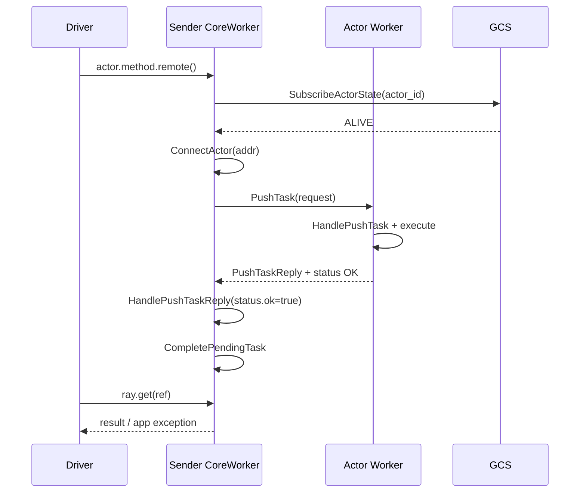
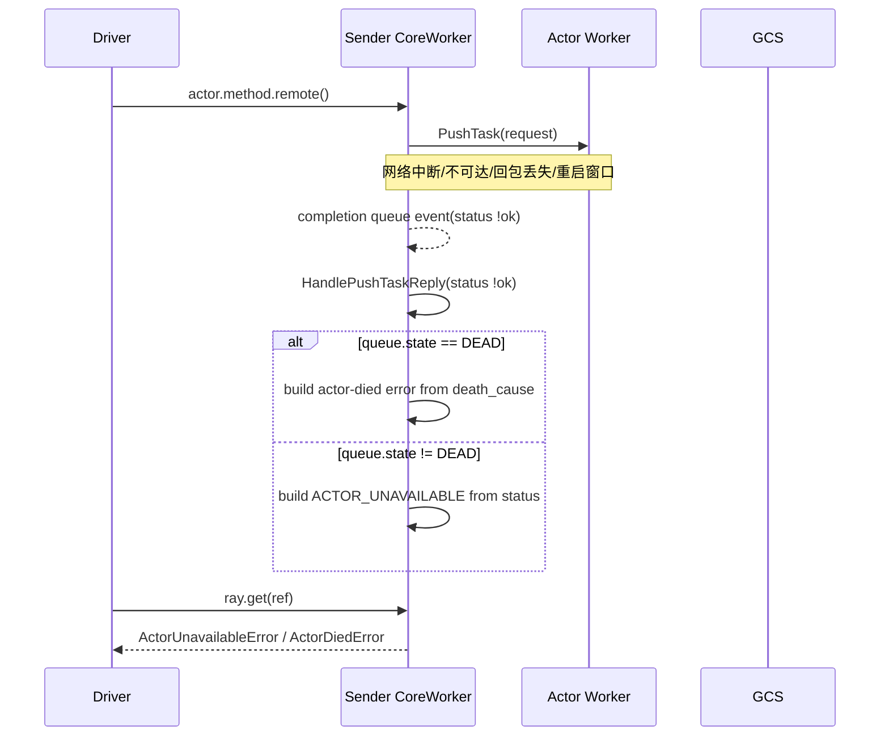
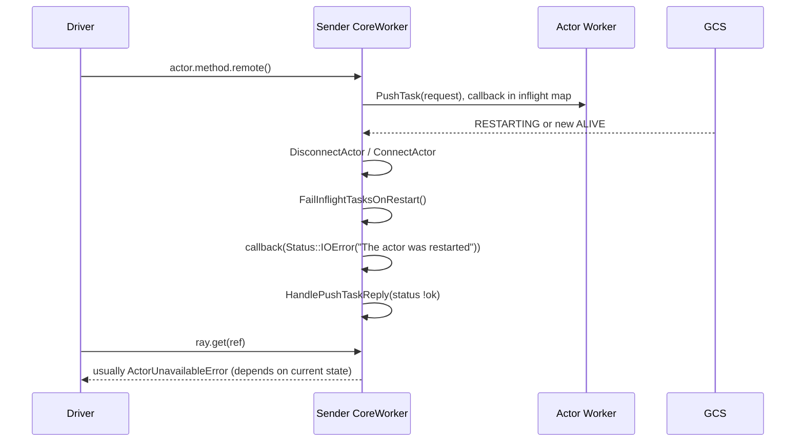

# Ray Actor `PushTask` 与 `ActorUnavailableError`

目标：用一条主线回答 4 个问题：

- `actor.method.remote()` 是否触发 `PushTask` RPC？
- “PushActorTask 的 RPC 回调”是什么？
- `ACTOR_UNAVAILABLE` 在哪里、为什么被构造？
- 为什么“没有成功回包”也会触发回调？

---

## 1) 主线流程：从 `remote()` 到 driver 看到异常

### A. 提交阶段（Driver -> Sender CoreWorker）

`actor.method.remote()` 会触发 actor task 提交，核心链路是：

- `python/ray/actor.py`：`ActorHandle._actor_method_call(...)`
- `python/ray/_raylet.pyx`：`submit_actor_task(...)`
- `src/ray/core_worker/core_worker.cc`：`CoreWorker::SubmitActorTask(...)`

在 `CoreWorker::SubmitActorTask(...)` 中有 3 个关键动作：

1. `actor_manager_->SubscribeActorState(actor_id)`  
   订阅 GCS actor 状态，驱动本地 `ALIVE/RESTARTING/DEAD` 状态机。
2. `task_manager_->AddPendingTask(...)`  
   先登记 pending task 并返回 `ObjectRef` 给上层。
3. `actor_task_submitter_->SubmitTask(task_spec)`  
   异步发送到目标 actor worker。

### B. 发送阶段（Sender CoreWorker -> Actor Worker）

- `src/ray/core_worker/task_submission/actor_task_submitter.cc`
  - `SubmitTask(...) -> SendPendingTasks(...) -> PushActorTask(...)`

在 `PushActorTask(...)` 中：

- 组装 `PushTaskRequest`
- 保存 in-flight 回调到 `inflight_task_callbacks_`
- 调 `core_worker_client_pool_.GetOrConnect(addr)->PushActorTask(...)`

注意命名差异：

- 客户端方法叫 `PushActorTask`
- gRPC 真正的方法是 `CoreWorkerService.PushTask`
- proto 定义在 `src/ray/protobuf/core_worker.proto`

### C. 执行与回包阶段（Actor Worker -> Sender CoreWorker）

- `src/ray/core_worker/core_worker.cc`：`CoreWorker::HandlePushTask(...)`
  - actor worker 接收 `PushTask`
  - 执行任务后通过 `send_reply_callback` 回 `PushTaskReply`

### D. 结果归并阶段（Sender CoreWorker -> Driver）

回包或失败事件最终进入：

- `src/ray/core_worker/task_submission/actor_task_submitter.cc`
  - `HandlePushTaskReply(const Status &status, const PushTaskReply &reply, ...)`

这里是最关键的分叉点：

- `status.ok() == true`：RPC 层成功（业务可成功，也可应用级异常）
- `status.ok() == false`：RPC 层失败（网络、不可达、重启窗口、回包丢失等）

当 `status !ok` 时：

- 若本地 `queue.state_ == DEAD`：按 `death_cause` 走 actor died 语义
- 若尚未 `DEAD`：构造 `ACTOR_UNAVAILABLE`，消息是  
  `The actor is temporarily unavailable: ` + `status.ToString()`

随后错误会被写入任务返回对象并在 Python 侧还原：

- `src/ray/core_worker/task_manager.cc` / `src/ray/common/ray_object.cc`（序列化）
- `python/ray/_private/serialization.py`（识别 `ACTOR_UNAVAILABLE`）
- `python/ray/exceptions.py`（构造 `ActorUnavailableError`）

---

## 2) 关键机制：回调、失败语义、与状态机的关系

### 2.1 “RPC 回调”到底是什么

这里的回调是 C++ 异步 RPC callback（不是 Python callback）：

- 类型：`ClientCallback<rpc::PushTaskReply>(Status, PushTaskReply&&)`
- 注册点：`ActorTaskSubmitter::PushActorTask(...)`
- 落点：`ActorTaskSubmitter::HandlePushTaskReply(...)`

### 2.2 为什么没成功回包也会触发回调

有两种来源：

1. **gRPC completion queue 的失败完成事件**  
   失败同样会产生完成事件并触发 callback。  
   代码：`src/ray/rpc/client_call.h` `PollEventsFromCompletionQueue(...)`

2. **系统主动合成失败回调**  
   actor 重启/连接切换时，会把旧 in-flight 回调取出并主动调用：
   `Status::IOError("The actor was restarted")`。  
   代码：`FailInflightTasksOnRestart(...)`，由 `ConnectActor(...)` / `DisconnectActor(...)` 触发。

### 2.3 为什么有时是 `UNAVAILABLE`，有时是 `DIED`

这是 RPC 失败到达时刻与 GCS 状态通知到达时刻的竞争结果：

- GCS 状态通知由  
  `src/ray/core_worker/actor_manager.cc` `HandleActorStateNotification(...)`
  驱动 `ConnectActor` / `DisconnectActor` 更新本地状态。
- 同一次 `status !ok`：
  - 若状态尚未收敛到 `DEAD` -> `ACTOR_UNAVAILABLE`
  - 若已经 `DEAD` -> `ACTOR_DIED`（或对应 death cause）

---

## 3) 四泳道时序图（统一视角）

### 场景 A：正常成功

### 场景 B：RPC 层失败（执行与否未知）

### 场景 C：重启切换触发“合成失败回调”

---

## 4) 排查落地（按这个顺序看）

1. 看 driver 异常中的 `status.ToString()`  
   这是 RPC 层失败的直接证据（通常包含 `RPC error: ...`）。
2. 对齐同时间窗口 actor 状态通知  
   查看是否发生 `ALIVE -> RESTARTING -> DEAD` 切换。
3. 判断是否命中“合成失败回调”路径  
   若日志出现 `"The actor was restarted"`，优先怀疑连接切换导致的 in-flight fail。

用这 3 步，基本能把问题归类到：

- 真实 RPC 失败（网络/不可达）
- 重启切换导致的 in-flight fail
- 已收敛为 `DEAD` 的死亡路径

